```mermaid
graph TD
    A[Ayanle's Tech Arsenal] --> B[Frontend]
    A --> C[Backend]
    A --> D[AI/ML]
    A --> E[Cloud & DevOps]
    A --> F[Databases]
    B --> B1[React]
    B --> B2[HTML5/CSS3]
    B --> B3[Tailwind CSS]
    B --> B4[Bootstrap]
    C --> C1[Python]
    C --> C2[Django]
    C --> C3[Flask]
    C --> C4[Java]
    C --> C5[C#]
    D --> D1[LLMs]
    D --> D2[RAG]
    D --> D3[NLP]
    D --> D4[Prompt Engineering]
    D --> D5[Langchain]
    E --> E1[AWS]
    E --> E2[Azure]
    E --> E3[Docker]
    E --> E4[CI/CD]
    E --> E5[Git]
    F --> F1[PostgreSQL]
    F --> F2[MongoDB]
    F --> F3[Firebase]
    F --> F4[Supabase]

    style A fill:#4CAF50,stroke:#333,stroke-width:4px
    style B fill:#2196F3,stroke:#333,stroke-width:2px
    style C fill:#FFC107,stroke:#333,stroke-width:2px
    style D fill:#9C27B0,stroke:#333,stroke-width:2px
    style E fill:#FF5722,stroke:#333,stroke-width:2px
    style F fill:#795548,stroke:#333,stroke-width:2px
```
  

  
  
  

🌟 Skill Odyssey: Explore My Tech Universe

---

## 💼 Professional Journey

  <h3 style="color: #FFD700; text-align: center;">🚀 Current Role: Software Engineering Fellow at Headstarter AI</h3>
  <ul style="list-style-type: none; padding-left: 0;">
    <li>🌟 Mastering advanced LLMs and RAG applications in an intensive 7-week AI Fellowship</li>
    <li>🛠️ Developing innovative AI solutions through collaborative projects and hackathons</li>
    <li>🧠 Sharpening cutting-edge AI skills and software engineering practices</li>
  </ul>

  <h3 style="color: #FFD700; text-align: center;">⚙️ Systems Automation Intern at MarvinWindows</h3>
  <ul style="list-style-type: none; padding-left: 0;">
    <li>🖥️ Engineered advanced GUIs with Ignition and Python for enhanced system control</li>
    <li>📊 Optimized database management using SQL for efficient data handling</li>
    <li>🛠️ Developed manual screens and recut systems for improved production precision</li>
    <li>🚀 Collaborated on critical bug fixes, boosting operational efficiency</li>
  </ul>

---

## 🏆 Flagship Projects

  <h3 style="color: #FFD700;">🗣️ Natural Language to SQL Web App</h3>
  
Bridging human language and database queries with AI

  <ul>
    <li>Python, Django, HTML, CSS, OpenAI GPT-3</li>
    <li>90% improvement in query accuracy</li>
    <li>98% accuracy across 1,000+ queries</li>
  </ul>

  <h3 style="color: #FFD700;">💼 Full-Stack CRM Application</h3>
  
Comprehensive customer relationship management solution

  <ul>
    <li>Django, Bootstrap, HTML, CSS, PostgreSQL</li>
    <li>Support for 1000+ concurrent users</li>
    <li>Advanced role-based access control</li>
  </ul>

  <h3 style="color: #FFD700;">🏀 NBA Player Statistics Dashboard</h3>
  
Real-time analytics for basketball enthusiasts

  <ul>
    <li>Django, NBA API, D3.js</li>
    <li>Real-time data for 450+ active players</li>
    <li>40% increase in user engagement</li>
  </ul>

---

## 📊 GitHub Analytics

  
  

  

---

## 🎓 Academic Excellence

  <h3 style="color: #FFD700; text-align: center;">North Dakota State University</h3>
  
🖥️ Bachelor of Science in Computer Science (Expected May 2026)

  
🚀 Focus: Full Stack Development & Artificial Intelligence

  
🏆 Achievements: Dean's List Fall 2022, Spring 2023

---

## 💡 Innovation Manifesto

  
"In the ever-evolving landscape of technology, I stand at the intersection of innovation and practicality. My code is not just a means to an end, but a bridge to future possibilities. With each project, I aim to push the boundaries of what's possible, transforming complex challenges into elegant solutions that drive progress and inspire change."

  
- Ayanle Aideed

---

  

