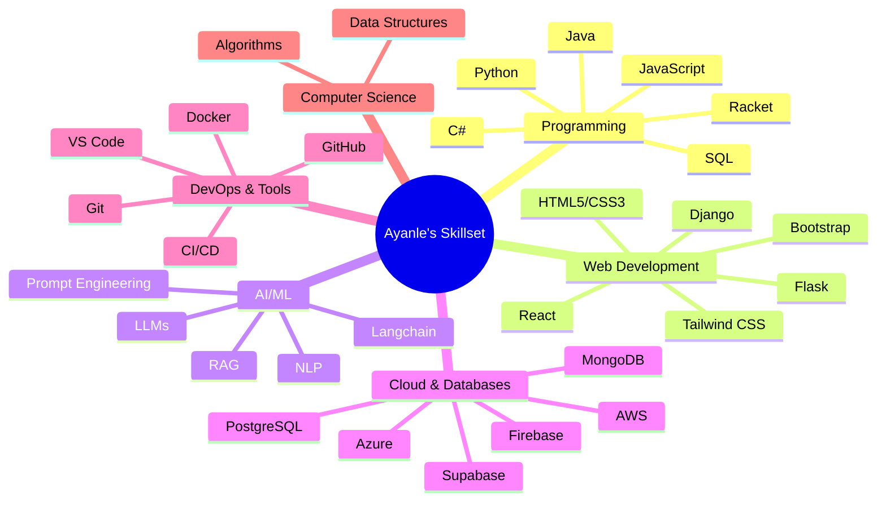

  

---

<h2 align="center">🚀 Quantum Leap into My Tech Universe 🌌</h2>

<table align="center">
  <tr>
    <td align="center" width="50%">
      
    </td>
    <td align="center" width="50%">
      
    </td>
  </tr>
</table>

---

<h2 align="center">🧠 Neural Network of Skills 🧠</h2>

---

<h2 align="center">🌟 Constellation of Projects 🌟</h2>

  <h3 style="color: #1E1E1E; text-align: center;">🗣️ Natural Language to SQL Alchemist</h3>
  <ul style="color: #1E1E1E;">
    <li>Python, Django, OpenAI GPT-3</li>
    <li>90% improvement in query accuracy</li>
    <li>1,000+ queries processed</li>
    <li>50 beta users, overwhelmingly positive feedback</li>
  </ul>

  <h3 style="color: #1E1E1E; text-align: center;">💼 Full-Stack CRM Nexus</h3>
  <ul style="color: #1E1E1E;">
    <li>Django, Bootstrap, PostgreSQL</li>
    <li>Complex CRUD operations</li>
    <li>Real-time data synchronization</li>
    <li>Role-based access control</li>
  </ul>

  <h3 style="color: #1E1E1E; text-align: center;">🏀 NBA Stats Hyperdrive</h3>
  <ul style="color: #1E1E1E;">
    <li>Django, D3.js, NBA API</li>
    <li>Real-time data for 450+ players</li>
    <li>Custom efficiency metrics</li>
    <li>Interactive visualizations</li>
  </ul>

---

<h2 align="center">💼 Professional Quantum Leaps 💼</h2>

<table align="center" style="width: 100%; border-collapse: separate; border-spacing: 0 15px;">
  <tr>
    <td style="width: 50%; padding: 20px; background: linear-gradient(45deg, #FF00FF, #00FFFF); border-radius: 10px; color: #1E1E1E;">
      <h3 style="text-align: center;">🚀 Headstarter AI</h3>
      
<strong>Software Engineering Fellow</strong> | Jul 2024 - Present

      <ul>
        <li>7-week intensive AI Fellowship</li>
        <li>Focus on LLMs and RAG applications</li>
        <li>Hackathons and real-world AI projects</li>
      </ul>
    </td>
    <td style="width: 50%; padding: 20px; background: linear-gradient(45deg, #00FF00, #FFFF00); border-radius: 10px; color: #1E1E1E;">
      <h3 style="text-align: center;">🏭 MarvinWindows</h3>
      
<strong>Systems Automation Intern</strong> | May 2023 - Present

      <ul>
        <li>Advanced GUI development with Ignition</li>
        <li>Python scripting for event automation</li>
        <li>SQL optimization for data management</li>
      </ul>
    </td>
  </tr>
</table>

---

<h2 align="center">🎓 Academic Warp Drive 🎓</h2>

  <h3>North Dakota State University</h3>
  
<strong>Bachelor of Science in Computer Science</strong>

  
Expected Graduation: May 2026

---

<h2 align="center">🌌 Innovator's Manifesto 🌌</h2>

  

    "In the vast expanse of the digital cosmos, I stand as both explorer and creator. With each line of code, I bridge the chasm between human imagination and technological reality. My mission is to harness the symbiotic power of AI and full-stack development, crafting solutions that not only address today's challenges but anticipate tomorrow's needs. I am not merely building software; I am architecting the future, one innovative commit at a time."
  

  
- Ayanle Aideed, Code Architect of Tomorrow

---

  

