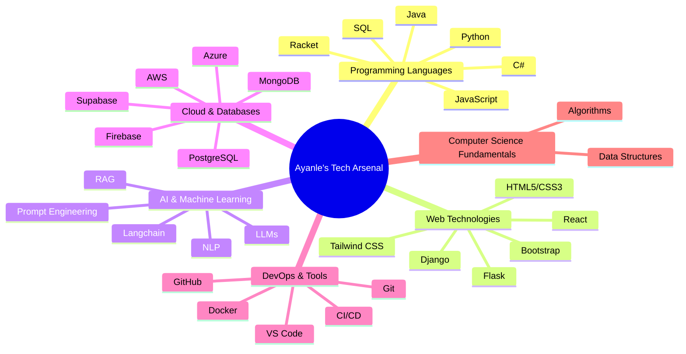

<!-- Simulated 3D Header with Particle Effect -->

  

<!-- Animated Introduction -->

  

<!-- Neon Badges -->

  
  
  

---

<!-- Quantum Metrics Section -->
<h2 align="center"> Quantum Metrics: Code Signature </h2>

  
  

---

<!-- Neural Nexus Skills Section -->
<h2 align="center"> Neural Nexus: Skill Matrix </h2>

  <!-- This would be replaced with an interactive 3D skill visualization on a custom website -->
  

<h3 style="display: inline-block; margin-left: 10px; color: #00FFFF;">🔬 Expand Full Skill Matrix</h3>

---

<!-- Project Constellation Section -->
<h2 align="center"> Project Constellation: Digital Marvels </h2>

  <h3 style="color: #081229; text-align: center;">🗣️ NL to SQL Alchemist</h3>
  <ul style="color: #081229;">
    <li>🐍 Python | 🎨 Django | 🧠 OpenAI GPT-3</li>
    <li>🎯 90% query accuracy boost</li>
    <li>🔢 1,000+ queries processed</li>
    <li>👥 50 beta users, rave reviews</li>
  </ul>

  <h3 style="color: #081229; text-align: center;">💼 CRM Nexus</h3>
  <ul style="color: #081229;">
    <li>🎨 Django | 🅱️ Bootstrap | 🐘 PostgreSQL</li>
    <li>🔄 Complex CRUD operations</li>
    <li>⚡ Real-time data sync</li>
    <li>🔐 Role-based access control</li>
  </ul>

  <h3 style="color: #081229; text-align: center;">🏀 NBA Stats Hyperdrive</h3>
  <ul style="color: #081229;">
    <li>🎨 Django | 📊 D3.js | 🏀 NBA API</li>
    <li>🔴 Live data: 450+ players</li>
    <li>📈 Custom efficiency metrics</li>
    <li>🖼️ Interactive visualizations</li>
  </ul>

---

<!-- Professional Experience Section -->
<h2 align="center"> Quantum Career Leaps </h2>

  

    <h3 style="text-align: center; color: #081229;">🚀 Headstarter AI</h3>
    
<strong>Software Engineering Fellow</strong> | Jul 2024 - Present

    <ul style="color: #081229;">
      <li>🧠 7-week AI immersion</li>
      <li>🤖 LLMs & RAG mastery</li>
      <li>🏆 Hackathons & real-world AI solutions</li>
    </ul>
  

  
  

    <h3 style="text-align: center; color: #081229;">🏭 MarvinWindows</h3>
    
<strong>Systems Automation Intern</strong> | May 2023 - Present

    <ul style="color: #081229;">
      <li>🖥️ Advanced GUI with Ignition</li>
      <li>🐍 Python automation scripting</li>
      <li>📊 SQL optimization wizardry</li>
    </ul>
  

---

<!-- Education Section -->
<h2 align="center"> Academic Warp Drive </h2>

  <h3>🎓 North Dakota State University</h3>
  
<strong>Bachelor of Science in Computer Science</strong>

  
🚀 Expected Graduation: May 2026

---

<!-- Innovator's Manifesto Section -->
<h2 align="center"> Innovator's Manifesto </h2>

  

    "In the cosmic expanse of the digital realm, I stand as both explorer and creator. Each line of code I craft is a bridge spanning the chasm between human imagination and technological reality. My mission: to harness the symbiotic power of AI and full-stack development, forging solutions that not only tackle today's challenges but anticipate the needs of tomorrow. I am not merely constructing software; I am architecting the future, one innovative commit at a time."
  

  
- Ayanle Aideed, Digital Reality Architect

---

  

  Forging Tomorrow's Digital Frontiers, One Commit at a Time

