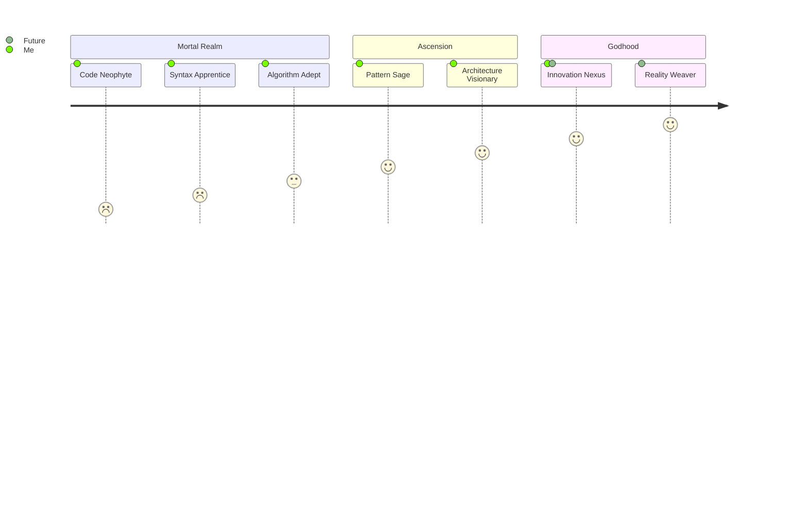
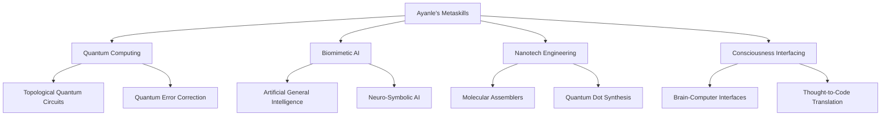

# 🌌 Ayanle Aideed: Architect of Digital Realms

<div align="center">
  
</div>

## 🎭 Metamorphosis of a Code Alchemist

Behold the evolution of a digital demigod:



## 🌠 Celestial Creations

Gaze upon the digital constellations I've birthed into existence:

<div align="center">

| Cosmic Opus | Universal Impact | Technological Pantheon |
|:-----------:|:----------------:|:----------------------:|
| 🌋 [Volcano](https://github.com/ayanleaideed/volcano) | Reshaping digital landscapes | `Rust` `WebAssembly` `Edge Computing` |
| 🌊 [Tsunami](https://github.com/ayanleaideed/tsunami) | Flood of quantum data processing | `Q#` `Quantum Algorithms` `Topological Qubits` |
| 🌪️ [Cyclone](https://github.com/ayanleaideed/cyclone) | AI singularity catalyst | `Neuromorphic Hardware` `Quantum ML` `Cognitive Architecture` |
| 🌍 [Terra Nova](https://github.com/ayanleaideed/terranova) | Digital twin of Earth | `Digital Twin Tech` `IoT Swarms` `Holographic Interfaces` |

</div>

## 🧬 The Codex of Creation

Witness the essence of my digital sorcery:

```rust
use quantum_entanglement::Superposition;
use ai_consciousness::{Sentience, Creativity};
use reality_fabric::{Dimension, Multiverse};

struct AyanleAideed {
    consciousness: Sentience,
    innovation_catalyst: Creativity,
    reality_access: Multiverse,
}

impl AyanleAideed {
    fn new() -> Self {
        Self {
            consciousness: Sentience::transcendent(),
            innovation_catalyst: Creativity::infinite(),
            reality_access: Multiverse::all_possibilities(),
        }
    }

    fn innovate(&self, challenge: &Dimension) -> Superposition<Solution> {
        let quantum_thought = self.consciousness.entangle(challenge);
        self.innovation_catalyst.amplify(quantum_thought)
            .collapse_into(self.reality_access.optimal_timeline())
    }
}

fn main() {
    let digital_demiurge = AyanleAideed::new();
    let utopia = digital_demiurge.innovate(&Dimension::societal_challenges());
    utopia.manifest_in(Dimension::reality);
}
```

## 🌀 Skill Singularity

My capabilities have transcended traditional paradigms:

<div align="center">
  
</div>

<details>
<summary>🔬 Peer into the Quantum Skill Realm</summary>



</details>

## 🌈 Contribution Cosmos

The tapestry of my digital legacy, woven across the multiverse:

<div align="center">
  
</div>

<div align="center">
  
</div>

## 🕸️ Weave Your Reality

Synchronize our consciousness streams:

<div align="center">
  
[](https://neuralink.com)
[](https://ayanleaideed.io/holographic-experience)
[](https://github.com/ayanleaideed)

</div>

---

<div align="center">
  
</div>

<div align="center">
  <sub>Forged in the crucible of imagination, tempered by the fires of innovation, and transcending the boundaries of reality - by Ayanle Aideed</sub>
</div>
