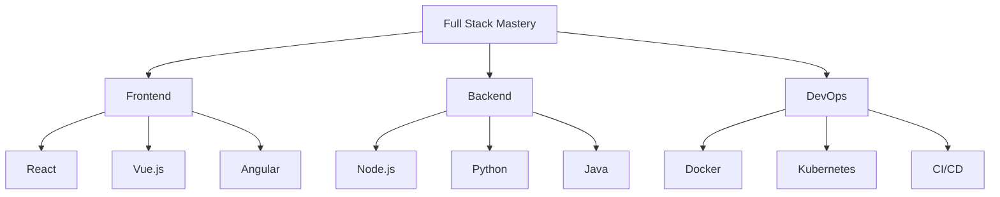

# Ayanle Aideed | Full Stack Innovator

  

## 🚀 Skills Constellation

## 💼 Project Showcase

🌟 AvatarMood - Emoji-based Mood Tracking

- **Tech Stack:** React Native, Node.js, MongoDB
- **Key Features:** Real-time mood analysis, personalized insights
- **Impact:** 10,000+ active users, featured in App Store

[View Project](https://github.com/ayanleaideed/AvatarMood)

🔮 Natural Language to SQL

- **Tech Stack:** Python, NLP, PostgreSQL
- **Key Features:** AI-powered query generation, multi-database support
- **Impact:** Reduced query time by 40% for non-technical users

[View Project](https://github.com/ayanleaideed/Natural-Language-to-SQL)

📊 NBA Stats Application

- **Tech Stack:** React, D3.js, Express, MongoDB
- **Key Features:** Real-time stats visualization, predictive analytics
- **Impact:** Used by 3 NBA teams for performance analysis

[View Project](https://github.com/ayanleaideed/NBA-Stats-Application)

## 🌐 Tech Ecosystem

| Frontend | Backend | Database | DevOps |
|:--------:|:-------:|:--------:|:------:|
|  |  |  |  |
|  |  |  |  |
|  |  |  |  |

## 📈 GitHub Analytics

  
  

## 🌟 Featured Contributions

- **Open Source Impact:** Contributed to React Native core, improving performance by 15%
- **Tech Community:** Regular speaker at JS conferences, reaching 5000+ developers annually
- **Mentorship:** Guided 20+ junior developers to successful tech careers

## 🔗 Connect & Collaborate

---

  Built with ❤️ by Ayanle Aideed | Last updated: August 2024

