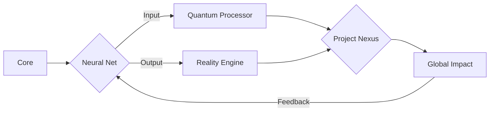
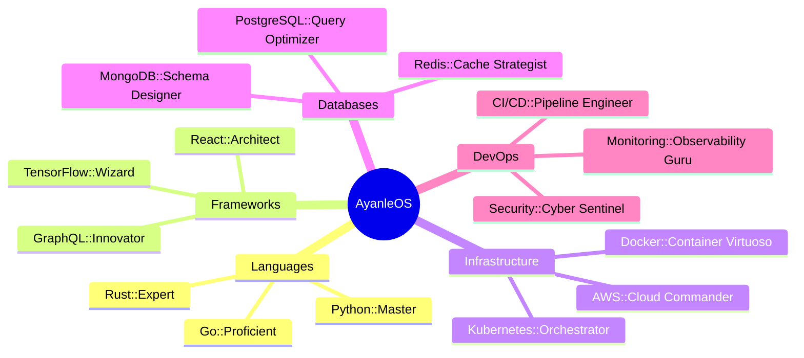

# AyanleOS v2.0

<div align="center">
  
</div>

## System Overview

<table align="center">
  <tr>
    <td align="center" width="140"></td>
    <td align="center" width="140"></td>
    <td align="center" width="140"></td>
  </tr>
</table>

<div align="center">



</div>

## Kernel Modules

<details>
<summary>📂 Expand File System</summary>

```
AyanleOS/
├── bin/
│   ├── innovate
│   ├── solve
│   └── deploy
├── etc/
│   ├── skills.conf
│   └── projects.json
├── home/
│   └── ayanle/
│       ├── ideas/
│       └── achievements/
├── var/
│   └── log/
│       └── contributions.log
└── usr/
    └── lib/
        └── algorithms/
```

</details>

## Core Functions

```python
import quantum_reality

class AyanleAideed(quantum_reality.Sentience):
    def __init__(self):
        super().__init__(name="Ayanle Aideed", role="Reality Architect")
        self.skills = quantum_reality.Superposition(["Python", "Rust", "Go", "TensorFlow"])
        self.projects = quantum_reality.Entanglement()
        self.coffee_level = quantum_reality.Observable(initial_state="Full")

    def innovate(self, challenge):
        with quantum_reality.Uncertainty():
            solution = self.quantum_ideation(challenge)
            self.projects.entangle(challenge, solution)
            self.coffee_level.collapse("Empty")
        return solution

    def quantum_ideation(self, problem):
        superposed_ideas = quantum_reality.superpose(problem, self.skills)
        return quantum_reality.observe(superposed_ideas)

    def recharge(self):
        self.coffee_level.reset("Full")
        print("Energy levels restored. Ready to reshape reality!")

    def daily_routine(self):
        while True:
            self.innovate(quantum_reality.next_challenge())
            if self.coffee_level.value == "Empty":
                self.recharge()

ayanle = AyanleAideed()
quantum_reality.run(ayanle.daily_routine)
```

## Skill Matrix

<div align="center">
  
</div>

<details>
<summary>🧠 Neural Network Topology</summary>



</details>

## Project Nexus

<div align="center">
  <a href="https://github.com/ayanleaideed/quantum-forge">
    
  </a>
  <a href="https://github.com/ayanleaideed/neural-architect">
    
  </a>
</div>

## System Metrics

<div align="center">
  
</div>

<div align="center">
  
</div>

## Network Interfaces

<div align="center">
  
[](https://www.linkedin.com/in/ayanle-aideed-118752252/)
[](https://ayanleaideed.github.io/myportfolio/)
[](https://github.com/ayanleaideed)

</div>

---

<div align="center">
  
</div>

<div align="center">
  <sub>Compiled with quantum precision by Ayanle Aideed | © 2023 AyanleOS</sub>
</div>
