# <div align="center">🌌 Ayanle Aideed's Interstellar Portfolio 🚀</div>

<div align="center">
  
</div>

## 🎨 Nebula of Skills

<table align="center">
<tr>
<td align="center" width="96">
<a href="#python">

</a>
<br>Python
</td>
<td align="center" width="96">
<a href="#javascript">

</a>
<br>JavaScript
</td>
<td align="center" width="96">
<a href="#java">

</a>
<br>Java
</td>
<td align="center" width="96">
<a href="#csharp">

</a>
<br>C#
</td>
<td align="center" width="96">
<a href="#react">

</a>
<br>React
</td>
<td align="center" width="96">
<a href="#django">

</a>
<br>Django
</td>
<td align="center" width="96">
<a href="#aws">

</a>
<br>AWS
</td>
<td align="center" width="96">
<a href="#azure">

</a>
<br>Azure
</td>
</tr>
</table>

## 🌟 Stellar Projects

<div align="center">
  <a href="https://github.com/ayanleaideed/natural-language-to-sql">
    
  </a>
  <a href="https://github.com/ayanleaideed/full-stack-crm">
    
  </a>
</div>
<div align="center">
  <a href="https://github.com/ayanleaideed/nba-stats-dashboard">
    
  </a>
</div>

## 🌈 Contribution Supernova

<div align="center">
  
</div>

## 🎭 Quantum Code Persona

```python
from typing import List, Dict
import random

class AyanleAideed:
    def __init__(self):
        self.name: str = "Ayanle Aideed"
        self.role: str = "Interdimensional Software Architect"
        self.languages: List[str] = ["Python", "JavaScript", "Java", "C#", "SQL"]
        self.interests: List[str] = ["AI/ML", "Full-Stack Development", "Cloud Architecture", "Data Visualization"]
        self.skills: Dict[str, List[str]] = {
            "Web Development": ["Django", "React", "HTML5", "CSS3", "Bootstrap", "Flask", "Tailwind CSS"],
            "AI/ML": ["LLMs", "RAG", "NLP", "Prompt Engineering", "Langchain"],
            "Cloud & Databases": ["AWS", "Azure", "PostgreSQL", "Firebase", "Supabase", "MongoDB"],
            "Tools": ["Git", "GitHub", "VS Code", "Jupyter Notebooks", "Docker", "CI/CD"]
        }
        self.favorite_color: str = self.generate_quantum_color()

    def code(self, complexity: int = 5) -> str:
        return "".join([chr((ord(c) + complexity) % 128) for c in "Hello, Multiverse!"])

    def generate_quantum_color(self) -> str:
        return f"#{random.randint(0, 0xFFFFFF):06x}"

    def solve_interdimensional_problem(self, problem: str) -> str:
        solution = self.apply_quantum_algorithm(problem)
        return f"Solution to '{problem}': {solution}"

    def apply_quantum_algorithm(self, data: str) -> str:
        # Imagine a complex quantum algorithm here
        return "Quantum solution: " + "".join(reversed(data))

    def daily_routine(self):
        self.consume_dark_matter_coffee()
        self.code_across_parallel_universes()
        self.learn_technology_from_future()
        self.contribute_to_open_source_multiverse()
        self.repeat()

me = AyanleAideed()
multiverse.big_bang(me.daily_routine)
```

## 🌠 Skill Constellation

```mermaid
graph TD
    A[Ayanle Aideed] --> B[Frontend]
    A --> C[Backend]
    A --> D[Cloud & DevOps]
    A --> E[AI & ML]
    B --> F[React]
    B --> G[Vue.js]
    B --> H[HTML/CSS]
    C --> I[Python]
    C --> J[Django]
    C --> K[Node.js]
    D --> L[AWS]
    D --> M[Azure]
    D --> N[Docker]
    E --> O[LLMs]
    E --> P[NLP]
    E --> Q[RAG]
    I --> R[Data Science]
    I --> S[Automation]
    style A fill:#FF00FF,stroke:#00FFFF,stroke-width:4px
    style B fill:#4B0082,stroke:#00FFFF,stroke-width:2px
    style C fill:#0000FF,stroke:#00FFFF,stroke-width:2px
    style D fill:#00FF00,stroke:#00FFFF,stroke-width:2px
    style E fill:#FF1493,stroke:#00FFFF,stroke-width:2px
    style F,G,H,I,J,K,L,M,N,O,P,Q,R,S fill:#1A1A1A,stroke:#FF00FF,stroke-width:2px
```

<div align="center">



</div>

## 🚀 Intergalactic Communication Channels

<div align="center">
  
[](https://www.linkedin.com/in/ayanle-aideed-118752252/)
[](https://ayanleaideed.github.io/portfolio/)
[](https://github.com/ayanleaideed)

</div>

## 🎵 Cosmic Coding Soundtrack

<div align="center">
  <a href="https://open.spotify.com/user/YOUR_SPOTIFY_USER_ID">
    
  </a>
</div>

---

<div align="center">
  
</div>

<div align="center">
  <sub>Crafted with 💜 and quantum entanglement by Ayanle Aideed | © 2024 Cosmic Code Creations</sub>
</div>
