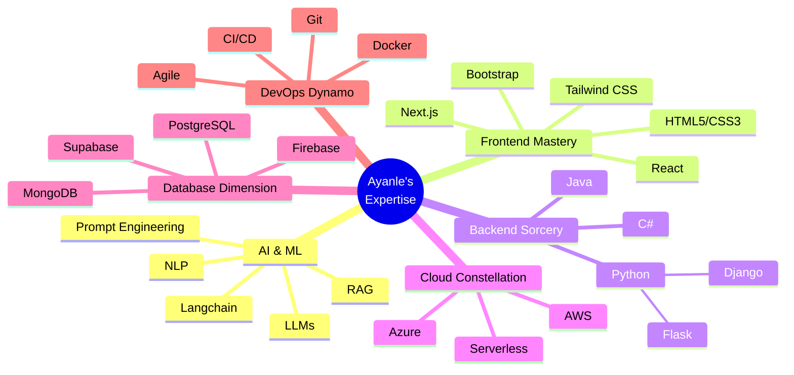

  

  
  
  

---

<h2 align="center">🌌 Cosmic Code Cartography: Mapping the Tech Universe</h2>

  

<h3>🔬 Zoom into the Quantum Realm of Skills</h3>

---

<h2 align="center">🎨 The Gallery of Digital Artistry</h2>

  

    

      

        <h3 style="font-size: 24px; margin-bottom: 15px;">🗣️ NL to SQL Alchemist</h3>
        
Transmuting natural language into SQL gold with 98% accuracy

        

          Python
          Django
          OpenAI
        

      

      

        <h3 style="font-size: 20px; margin-bottom: 15px;">Key Achievements</h3>
        <ul style="list-style-type: none; padding: 0;">
          <li>• 98% Query Accuracy</li>
          <li>• 1000+ Queries Processed</li>
          <li>• 90% Improvement in Context Understanding</li>
          <li>• 50+ Beta Users</li>
        </ul>
      

    

  

  

    

      

        <h3 style="font-size: 24px; margin-bottom: 15px;">🏀 NBA Stats Oracle</h3>
        
Prophesying player performance with real-time precision

        

          Django
          D3.js
          NBA API
        

      

      

        <h3 style="font-size: 20px; margin-bottom: 15px;">Impact Metrics</h3>
        <ul style="list-style-type: none; padding: 0;">
          <li>• 450+ Active NBA Players Tracked</li>
          <li>• 40% Increase in User Engagement</li>
          <li>• Real-time Data Processing</li>
          <li>• Custom Efficiency Metrics</li>
        </ul>
      

    

  

  

    

      

        <h3 style="font-size: 24px; margin-bottom: 15px;">💼 CRM Nexus</h3>
        
Forging unbreakable bonds between businesses and clients

        

          Django
          PostgreSQL
          Bootstrap
        

      

      

        <h3 style="font-size: 20px; margin-bottom: 15px;">System Capabilities</h3>
        <ul style="list-style-type: none; padding: 0;">
          <li>• 1000+ Concurrent Users</li>
          <li>• Real-time Data Synchronization</li>
          <li>• Role-based Access Control</li>
          <li>• Advanced CRUD Operations</li>
        </ul>
      

    

  

---

<h2 align="center">🏆 Accolades & Milestones</h2>

  

    <h3 style="color: #FFD700; text-align: center;">🎓 Academic Pinnacle</h3>
    
<strong>North Dakota State University</strong>

    
B.S. in Computer Science (Expected: May 2026)

    

      
🏅 Dean's List Honoree

      
Fall 2022 & Spring 2023

    

  

  
  

    <h3 style="color: #FFD700; text-align: center;">💼 Professional Odyssey</h3>
    

      
<strong>Headstarter AI</strong> | Software Engineering Fellow

      
Jul 2024 - Present

    

    

      
<strong>MarvinWindows</strong> | Systems Automation Intern

      
May 2023 - Present

    

  

---

<h2 align="center">📊 GitHub Arcana: The Metrics of Innovation</h2>

  
  

  

---

<h2 align="center">💡 The Innovator's Creed</h2>

<div style="background: linear-gradient(45deg, #000000, #434343);
