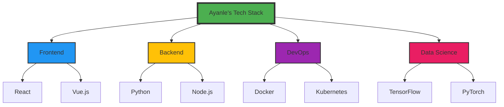
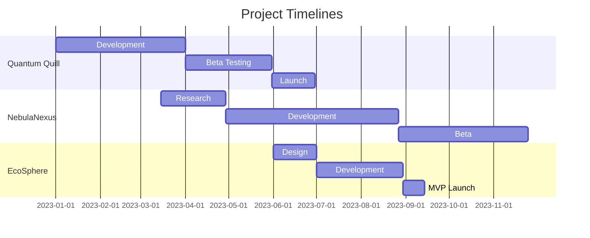
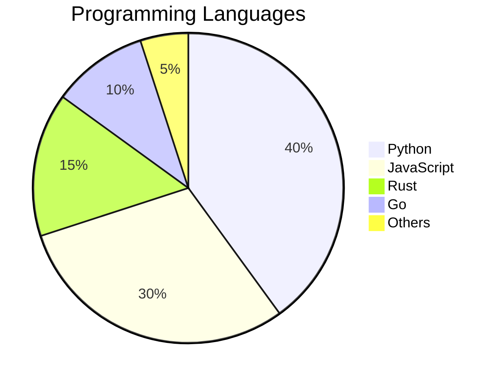

# 🌌 Ayanle Aideed: Architect of Digital Realms

<div align="center">
  
</div>

---

<details open>
<summary><h2>🎭 Persona Shift</h2></summary>
<div align="center">

| Mode | Persona | Focus |
|:----:|:-------:|:-----:|
| 👨‍💻 | **The Coder** | Crafting elegant solutions |
| 🧠 | **The Thinker** | Conceptualizing groundbreaking ideas |
| 🚀 | **The Innovator** | Pushing technological boundaries |
| 🤝 | **The Collaborator** | Building synergistic partnerships |

</div>
</details>

---

## 🛠 Tech Arsenal

<div align="center">



</div>

<details>
<summary><h3>🔬 Expand Tech Proficiency</h3></summary>

<div align="center">

| Category | Technologies |
|:--------:|:------------:|
| Languages |    |
| Frameworks |    |
| Databases |   |
| DevOps |   |
| Cloud |   |

</div>
</details>

---

## 🌟 Project Cosmos

<div align="center">

| Project | Description | Tech Stack | Status |
|:-------:|:-----------:|:----------:|:------:|
| [Quantum Quill](https://github.com/ayanleaideed/quantum-quill) | AI-powered creative writing assistant | `Python` `TensorFlow` `Flask` |  |
| [NebulaNexus](https://github.com/ayanleaideed/nebula-nexus) | Decentralized social network | `Rust` `WebAssembly` `React` |  |
| [EcoSphere](https://github.com/ayanleaideed/eco-sphere) | Sustainable living tracker | `Vue.js` `Node.js` `MongoDB` |  |

</div>

<details>
<summary><h3>🔍 Project Insights</h3></summary>

<div align="center">



</div>
</details>

---

## 🧠 Code Philosophy

> "In the grand tapestry of technology, each line of code is a thread weaving innovation into reality." - Ayanle Aideed

<div align="center">

```python
def ayanle_approach(problem):
    while not solved:
        solution = innovative_thinking(problem)
        if is_elegant(solution) and is_scalable(solution):
            implement(solution)
            break
        else:
            refine(solution)
    
    return solution

def innovative_thinking(problem):
    return blend(
        out_of_box_ideas,
        cutting_edge_tech,
        ethical_considerations
    )

# The journey of a thousand miles begins with a single line of code
ayanle_approach(world_challenges)
```

</div>

---

## 📊 Impact Metrics

<div align="center">


</div>

<details>
<summary><h3>📈 Contribution Insights</h3></summary>

<div align="center">



</div>
</details>

---

## 🌐 Digital Footprint

<div align="center">

[](https://ayanleaideed.dev)
[](https://www.linkedin.com/in/ayanle-aideed)
[](https://github.com/ayanleaideed)
[](https://twitter.com/ayanleaideed)

</div>

---

<div align="center">
  
</div>

<div align="center">
  <sub>Crafted with 💻 and 🌟 by Ayanle Aideed | Last updated: 2024-08-20</sub>
</div>
