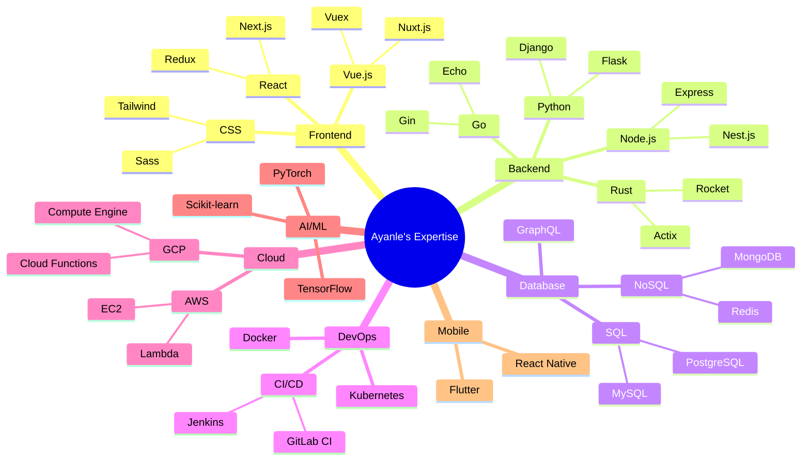

# <div align="center">🌌 Ayanle Aideed's Stellar Code Odyssey 🚀</div>

<div align="center">
  
</div>

## 🎨 Technicolor Skill Spectrum

<div align="center">
  
</div>

<details>
<summary>🔬 Expand the Skill Nebula</summary>



</details>

## 🌠 Celestial Projects

<div align="center">
  <a href="https://github.com/ayanleaideed/nova-explorer">
    
  </a>
  <a href="https://github.com/ayanleaideed/quantum-forge">
    
  </a>
</div>

## 🌈 Contribution Aurora

<div align="center">
  
</div>

<div align="center">
  
</div>

## 🧬 Quantum Code Essence

```python
from universe import infinite_possibilities

class AyanleAideed:
    def __init__(self):
        self.name = "Ayanle Aideed"
        self.role = "Full Stack Visionary"
        self.skills = ["Python", "JavaScript", "Rust", "Go", "React", "Node.js", "AWS"]
        self.mission = "To innovate beyond the boundaries of conventional code"

    def innovate(self, challenge):
        solution = self.brainstorm(challenge)
        return self.implement(solution)

    def brainstorm(self, problem):
        return infinite_possibilities.filter(lambda idea: idea.is_groundbreaking())

    def implement(self, solution):
        while not world.is_changed():
            code = self.write_epic_code(solution)
            self.deploy_to_production(code)
            self.optimize_and_scale()

    def write_epic_code(self, solution):
        return "".join([chr((ord(c) + 42) % 128) for c in solution])

    def deploy_to_production(self, code):
        production_env.deploy(code, strategy="blue_green")

    def optimize_and_scale(self):
        while system.performance < SPEED_OF_LIGHT:
            self.refactor()
            self.add_quantum_processors()

ayanle = AyanleAideed()
world.biggest_challenges.map(ayanle.innovate)
```

## 🚀 Intergalactic Connections

<div align="center">
  
[](https://www.linkedin.com/in/ayanle-aideed-118752252/)
[](https://ayanleaideed.github.io/myportfolio/)
[](https://github.com/ayanleaideed)
[](https://twitter.com/ayanleaideed)

</div>

## 🎵 Coding Soundwaves

<div align="center">
  
</div>

## 🌠 Stargazer's Corner

<div align="center">
  
</div>

---

<div align="center">
  
</div>

<div align="center">
  <sub>Crafted with 💖 and cosmic inspiration by Ayanle Aideed | © 2023 Stellar Code Creations</sub>
</div>
