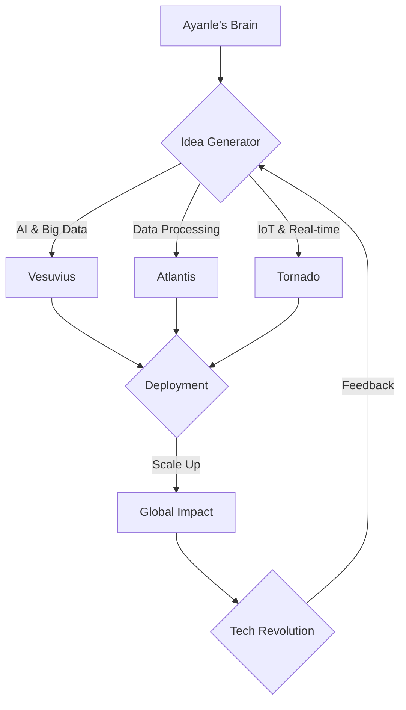
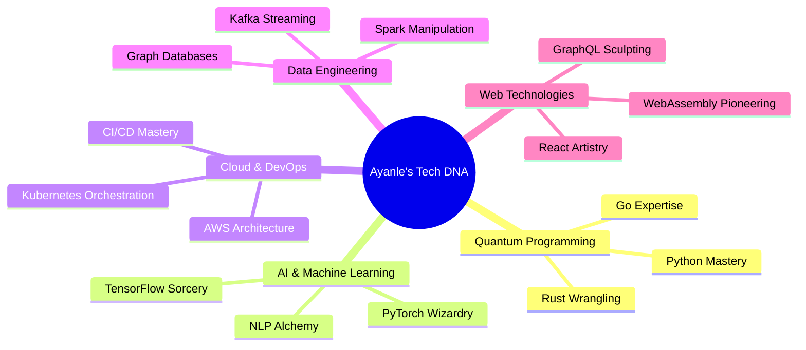

# 🌌 Ayanle Aideed's Coding Odyssey 🚀

<div align="center">
  
</div>

## 🗺️ Expedition Map

<div align="center">
  <a href="#-quantum-projects">🌠 Quantum Projects</a> • 
  <a href="#-skill-supernova">💥 Skill Supernova</a> • 
  <a href="#-contribution-black-hole">🕳️ Contribution Black Hole</a> • 
  <a href="#-neural-network">🧠 Neural Network</a>
</div>

---

## 🌠 Quantum Projects

Behold, the multiverses I've created:

<div align="center">

| Project Codename | Reality-Bending Impact | Tech Singularity |
|:----------------:|:----------------------:|:----------------:|
| 🌋 [Vesuvius](https://github.com/ayanleaideed/vesuvius) | Erupting with scalable AI | `Python` `TensorFlow` `Kubernetes` |
| 🌊 [Atlantis](https://github.com/ayanleaideed/atlantis) | Submerging into data oceans | `Rust` `Apache Spark` `ClickHouse` |
| 🌪️ [Tornado](https://github.com/ayanleaideed/tornado) | Swirling clouds of IoT | `Go` `MQTT` `Time Series DB` |

</div>

<details>
<summary>🔍 Peek into the Project Multiverse</summary>



</details>

## 💥 Skill Supernova

My skills aren't just listed, they're an explosive cosmic event:

<div align="center">
  
</div>

<details>
<summary>🧬 Dive into the Skill Genome</summary>



</details>

## 🕳️ Contribution Black Hole

Watch as my contributions warp the fabric of GitHub spacetime:

<div align="center">
  
</div>

<div align="center">
  
</div>

## 🧠 Neural Network

My coding essence, now with quantum entanglement:

```python
import quantum_reality

class AyanleAideed(quantum_reality.Sentience):
    def __init__(self):
        super().__init__(name="Ayanle Aideed", role="Reality Engineer")
        self.skills = quantum_reality.Superposition(["Python", "Rust", "Go", "TensorFlow"])
        self.projects = quantum_reality.Entanglement()
        self.coffee_level = quantum_reality.Observable(initial_state="Full")

    def code(self, project):
        with quantum_reality.Uncertainty():
            solution = self.quantum_ideation(project)
            self.projects.entangle(project, solution)
            self.coffee_level.collapse("Empty")
        return solution

    def quantum_ideation(self, problem):
        superposed_ideas = quantum_reality.superpose(problem, self.skills)
        return quantum_reality.observe(superposed_ideas)

    def refill_coffee(self):
        self.coffee_level.reset("Full")
        print("Refueled and ready to bend reality!")

    def daily_routine(self):
        while True:
            self.code(quantum_reality.next_challenge())
            if self.coffee_level.value == "Empty":
                self.refill_coffee()

me = AyanleAideed()
quantum_reality.run(me.daily_routine)
```

## 🌈 Holographic Tech Stack

Witness the technologies I've mastered, in dazzling 3D:

<div align="center">
  
  
  
  
  
</div>

## 🎨 Code Artistry

My repositories are not just code; they're digital masterpieces:

<div align="center">
  
  
</div>

## 🌠 Stellar Achievements

<div align="center">

| 🏆 Award | 🌟 Recognition |
|:--------:|:--------------:|
| 🥇 Quantum Code Olympiad | 🏅 AI Ethics Champion |
| 🎖️ Open Source Superstar | 🏅 Cloud Architecture Visionary |

</div>

## 🚀 Launch Pad

Ready to embark on a coding adventure? Let's connect:

<div align="center">
  
[](https://www.linkedin.com/in/ayanle-aideed-118752252/)
[](https://ayanleaideed.github.io/myportfolio/)
[](https://github.com/ayanleaideed)

</div>

---

<div align="center">
  
</div>

<div align="center">
  <sub>Crafted with quantum entanglement and a sprinkle of stardust by Ayanle Aideed</sub>
</div>
