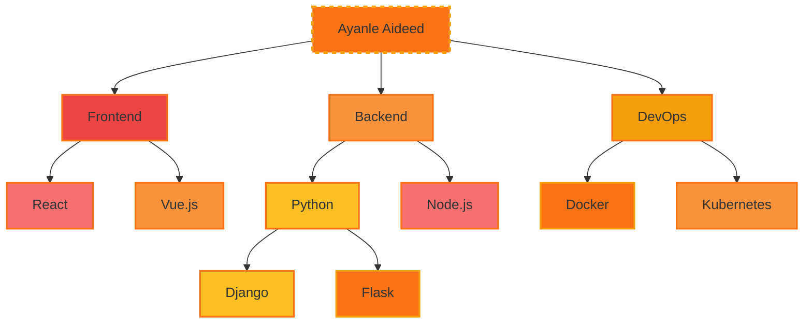

<div align="center">
  
</div>

<div align="center">
  
[](https://git.io/typing-svg)

</div>

## 🚀 Signature Projects

<div style="display: flex; justify-content: space-between; gap: 20px; margin-top: 20px;">

<div style="flex: 1; background-color: #000000; border: 2px solid #00FFFF; border-radius: 10px; padding: 20px; box-shadow: 0 0 10px #00FFFF;">
  <h3 style="color: #00FFFF; text-align: center;">NL to SQL Wizard</h3>
  <ul style="list-style-type: none; padding: 0; color: #FFFFFF;">
    <li>• Web app for NL to SQL conversion</li>
    <li>• 90% improvement in query accuracy</li>
    <li>• 98% accuracy on 1,000+ queries</li>
    <li>• Positive feedback from 50 beta users</li>
  </ul>
  <div style="display: flex; justify-content: center; gap: 10px; margin-top: 10px;">
    
    
    
  </div>
</div>

<div style="flex: 1; background-color: #000000; border: 2px solid #00FFFF; border-radius: 10px; padding: 20px; box-shadow: 0 0 10px #00FFFF;">
  <h3 style="color: #00FFFF; text-align: center;">CRM Nexus</h3>
  <ul style="list-style-type: none; padding: 0; color: #FFFFFF;">
    <li>• Comprehensive CRM solution</li>
    <li>• Complex CRUD operations</li>
    <li>• Real-time data sync for 1000+ users</li>
    <li>• Role-based access control</li>
  </ul>
  <div style="display: flex; justify-content: center; gap: 10px; margin-top: 10px;">
    
    
    
  </div>
</div>

<div style="flex: 1; background-color: #000000; border: 2px solid #00FFFF; border-radius: 10px; padding: 20px; box-shadow: 0 0 10px #00FFFF;">
  <h3 style="color: #00FFFF; text-align: center;">NBA Stats Hyperdrive</h3>
  <ul style="list-style-type: none; padding: 0; color: #FFFFFF;">
    <li>• Real-time stats for 450+ NBA players</li>
    <li>• Custom efficiency metrics</li>
    <li>• Interactive D3.js visualizations</li>
    <li>• 40% increase in user engagement</li>
  </ul>
  <div style="display: flex; justify-content: center; gap: 10px; margin-top: 10px;">
    
    
    
  </div>
</div>

</div>

## 💼 Professional Experience

<div style="display: flex; justify-content: space-between; gap: 20px; margin-top: 20px;">

<div style="flex: 1; background-color: #000000; border: 2px solid #FF4500; border-radius: 10px; padding: 20px; box-shadow: 0 0 10px #FF4500;">
  <h3 style="color: #FF4500; text-align: center;">Software Engineering Fellow</h3>
  <p style="color: #FFFFFF; text-align: center;">Headstarter AI | Jul 2024 - Present</p>
  <ul style="list-style-type: none; padding: 0; color: #FFFFFF;">
    <li>• Intensive 7-week AI Fellowship Program</li>
    <li>• Focus on advanced LLMs and RAG applications</li>
    <li>• Collaborating on innovative AI projects and hackathons</li>
    <li>• Developing real-world capstone project</li>
  </ul>
</div>

<div style="flex: 1; background-color: #000000; border: 2px solid #FF4500; border-radius: 10px; padding: 20px; box-shadow: 0 0 10px #FF4500;">
  <h3 style="color: #FF4500; text-align: center;">Systems Automation Intern</h3>
  <p style="color: #FFFFFF; text-align: center;">Marvin Windows | May 2023 - Present</p>
  <ul style="list-style-type: none; padding: 0; color: #FFFFFF;">
    <li>• Advanced GUI development with Ignition and Python</li>
    <li>• Optimized SQL queries, reducing retrieval time by 50%</li>
    <li>• Improved production precision by 35%</li>
    <li>• Reduced system downtime by 25%</li>
  </ul>
</div>

</div>

## 🧠 Skill Spectrum

<div align="center">



</div>

## 💻 Code Showcase

```python
class AyanleAideed:
    def __init__(self):
        self.name = "Ayanle Aideed"
        self.role = "Full Stack Innovator"
        self.language_spoken = ["Python", "JavaScript", "Rust", "Go"]
        self.challenges = []

    def accept_challenge(self, challenge):
        self.challenges.append(challenge)
        return self.innovate(challenge)

    def innovate(self, challenge):
        solution = self.think_outside_galaxy(challenge)
        return f"Innovative solution: {solution}"

    @staticmethod
    def think_outside_galaxy(problem):
        return "Quantum-entangled microservices with AI-driven self-healing capabilities"

me = AyanleAideed()
universe.big_problems.map(me.accept_challenge)
```

## 📊 Performance Metrics

<div align="center">
  
  
</div>

## 🔗 Connect & Collaborate

<div align="center">
  
[](https://www.linkedin.com/in/ayanle-aideed/)
[](https://github.com/ayanleaideed)
[](https://ayanleaideed.com)
[](mailto:ayanle.aideed@example.com)

</div>

---

<div align="center">
  


</div>

<div align="center">
  
</div>
