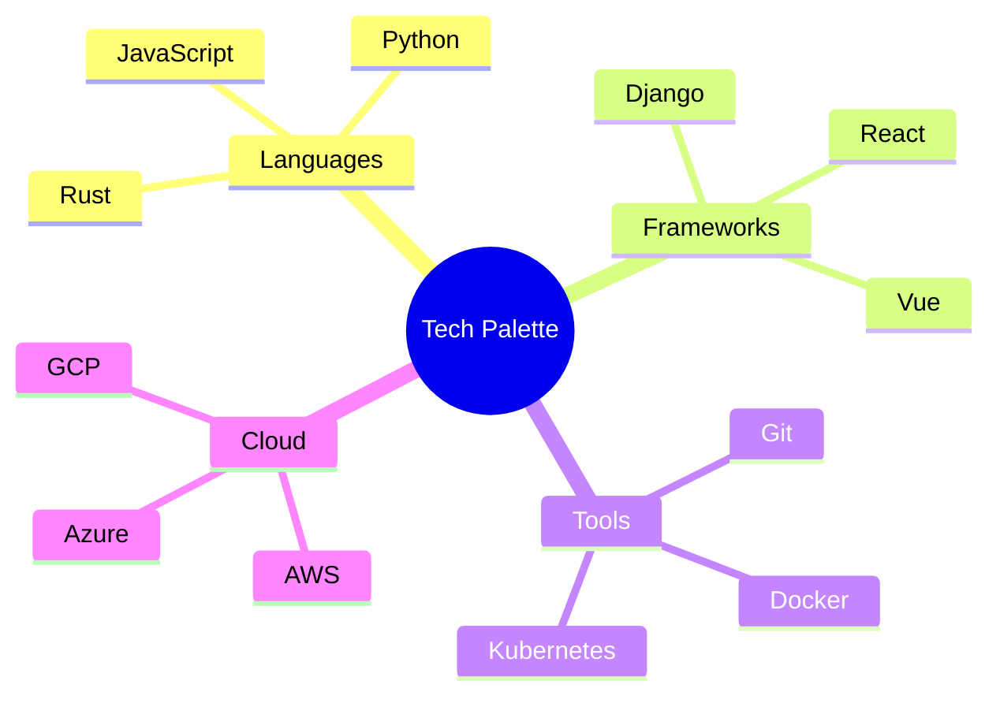

  

# 🧪 Welcome to the Laboratory of Innovation 🧬

  

---

## 🌈 Spectrum of Expertise

  <table>
    <tr>
      <td align="center">
         
        <b>Frontend Sorcery</b>
      </td>
      <td align="center">
         
        <b>Backend Alchemy</b>
      </td>
      <td align="center">
         
        <b>AI Enchantment</b>
      </td>
      <td align="center">
         
        <b>DevOps Mastery</b>
      </td>
    </tr>
  </table>

---

## 🎨 Palette of Technologies

---

## 🚀 Launchpad of Projects

  <table>
    <tr>
      <th>Project Codename</th>
      <th>Mission Objective</th>
      <th>Tech Arsenal</th>
      <th>Launch Status</th>
    </tr>
    <tr>
      <td><a href="#" style="color: #FF00FF;">Nebula Nexus</a></td>
      <td>Decentralized Social Platform</td>
      <td><code>React</code> <code>Solidity</code> <code>IPFS</code></td>
      <td></td>
    </tr>
    <tr>
      <td><a href="#" style="color: #00FFFF;">Quantum Quill</a></td>
      <td>AI-Powered Storytelling Engine</td>
      <td><code>Python</code> <code>TensorFlow</code> <code>Flask</code></td>
      <td></td>
    </tr>
    <tr>
      <td><a href="#" style="color: #FF00FF;">Cyber Synthesis</a></td>
      <td>Augmented Reality Code Visualizer</td>
      <td><code>Unity</code> <code>C#</code> <code>ARKit</code></td>
      <td></td>
    </tr>
  </table>

---

## 💡 Illuminating Insights

  

  

---

## 🌐 Quantum Entanglement (Let's Connect!)

  
  
  
  

---

  

  Crafted with 💖 and ✨ by the Digital Alchemist | Last transmutation: 

