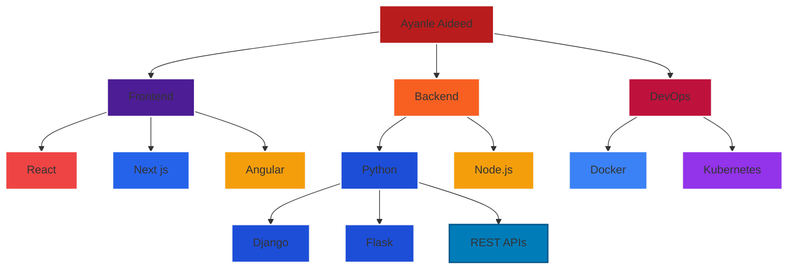

<div align="center">
  <h1 style="color: #FFB6C1; font-size: 3.5rem; font-family: 'Poppins', sans-serif; margin-bottom: 0;">
    Ayanle Aideed's Stellar Tech Portfolio
  </h1>
</div>

<div align="center">
  
</div>

<div align="center">
  <a href="https://git.io/typing-svg">
    
  </a>
</div>

## 🚀  Signature Projects

<table style="width: 100%; border-collapse: collapse;">
  <tr>
    <td style="width: 33%; vertical-align: top; padding: 20px; background-color: #1a1b1e; border-radius: 8px; margin: 10px;">
      <h3 style="margin-bottom: 15px; color: white;">NL to SQL Wizard</h3>
      <div style="background-color: #FF4500; color: white; padding: 8px; border-radius: 4px; margin-bottom: 15px;">
        NL TO SQL WIZARD
      </div>
      <ul style="list-style-type: none; padding: 0; margin: 0; text-align: left; color: white;">
        <li style="margin-bottom: 12px; padding-left: 20px; position: relative;">
          • Developed ML-powered natural language to SQL converter
        </li>
        <li style="margin-bottom: 12px; padding-left: 20px; position: relative;">
          • Implemented query optimization reducing execution time by 90%
        </li>
        <li style="margin-bottom: 12px; padding-left: 20px; position: relative;">
          • Processed 1,000+ queries with 98% accuracy rate
        </li>
        <li style="margin-bottom: 12px; padding-left: 20px; position: relative;">
          • Integrated user feedback system with 92% satisfaction score
        </li>
      </ul>
      <div style="margin-top: 15px;">
        
        
        
        
        
        
      </div>
    </td>
    <td style="width: 33%; vertical-align: top; padding: 20px; background-color: #1a1b1e; border-radius: 8px; margin: 10px;">
      <h3 style="margin-bottom: 15px; color: white;">CRM Nexus</h3>
      <div style="background-color: #00FFFF; color: black; padding: 8px; border-radius: 4px; margin-bottom: 15px;">
        CRM NEXUS
      </div>
      <ul style="list-style-type: none; padding: 0; margin: 0; text-align: left; color: white;">
        <li style="margin-bottom: 12px; padding-left: 20px; position: relative;">
          • Built full-stack CRM system with role-based access control
        </li>
        <li style="margin-bottom: 12px; padding-left: 20px; position: relative;">
          • Implemented real-time data sync supporting 1000+ concurrent users
        </li>
        <li style="margin-bottom: 12px; padding-left: 20px; position: relative;">
          • Designed RESTful API with 99.9% uptime
        </li>
        <li style="margin-bottom: 12px; padding-left: 20px; position: relative;">
          • Reduced data retrieval latency by 60%
        </li>
      </ul>
      <div style="margin-top: 15px;">
        
        
        
        
        
      </div>
    </td>
    <td style="width: 33%; vertical-align: top; padding: 20px; background-color: #1a1b1e; border-radius: 8px; margin: 10px;">
      <h3 style="margin-bottom: 15px; color: white;">NBA Stats Hub</h3>
      <div style="background-color: #FF4500; color: white; padding: 8px; border-radius: 4px; margin-bottom: 15px;">
        NBA STATS HUB
      </div>
      <ul style="list-style-type: none; padding: 0; margin: 0; text-align: left; color: white;">
        <li style="margin-bottom: 12px; padding-left: 20px; position: relative;">
          • Created interactive dashboard for real-time NBA statistics
        </li>
        <li style="margin-bottom: 12px; padding-left: 20px; position: relative;">
          • Engineered custom player performance analytics pipeline
        </li>
        <li style="margin-bottom: 12px; padding-left: 20px; position: relative;">
          • Implemented responsive data tables and statistical visualizations
        </li>
        <li style="margin-bottom: 12px; padding-left: 20px; position: relative;">
          • Increased user engagement by 40% through UI optimization
        </li>
      </ul>
      <div style="margin-top: 15px;">
        
        
        
        
        
        
      </div>
    </td>
  </tr>
</table>


## 💼 Elite Professional Experience
<table>
  <tr>
    <th>Position</th>
    <th>Company</th>
    <th>Duration</th>
    <th>Key Achievements</th>
  </tr>
  <tr>
    <td align="center">
      
    </td>
    <td align="center">NDSU Undergraduate Biomedical ML/LLM Researcher</td>
    <td align="center">Sep 2024 - Apr 2025</td>
    <td>
      • Utilizing ML models to analyze and predict patient health outcomes<br>
      • Exploring LLM applications for personalized healthcare recommendations<br>
      • Implementing NLP techniques for processing medical literature and data<br>
      • Contributing to innovative AI-driven solutions in biomedical research
    </td>
  </tr>
    <td align="center">
      
    </td>
    <td align="center">Headstarter AI</td>
    <td align="center">Jul 2024 - Present</td>
    <td>
      • Mastering cutting-edge AI Fellowship Program<br>
      • Pioneering advanced LLMs and RAG applications<br>
      • Spearheading innovative AI projects and hackathons<br>
      • Developing game-changing real-world capstone project
    </td>
  </tr>
  <tr>
    <td align="center">
      
    </td>
    <td align="center">Marvin Windows</td>
    <td align="center">Sep 2022 - Present</td>
    <td>
      • Revolutionizing GUI development with Ignition and Python<br>
      • Achieving 50% faster SQL query retrieval through optimization<br>
      • Boosting production precision by an impressive 35%<br>
      • Slashing system downtime by a remarkable 25%
    </td>
  </tr>
</table>


## 🧠 Skill Spectrum Architecture

<div align="center">


## System Architecture


</div>

## 💻 Code Showcase


<!-- <summary>Click to expand</summary> -->

```python
class AyanleAideed:
    def __init__(self):
        self.name = "Ayanle Aideed"
        self.role = "Full Stack Innovator"
        self.language_spoken = ["Python", "JavaScript", "C#", "Java"]
        self.challenges = []

    def accept_challenge(self, challenge):
        self.challenges.append(challenge)
        return self.innovate(challenge)

    def innovate(self, challenge):
        solution = self.think_outside_galaxy(challenge)
        return f"Innovative solution: {solution}"

    @staticmethod
    def think_outside_galaxy(problem):
        return "Quantum-entangled microservices with AI-driven self-healing capabilities"

me = AyanleAideed()
universe.big_problems.map(me.accept_challenge)
```


## 💬 Peer Recognition

<div align="center">
  
</div>

<blockquote style="border-left: 4px solid #FF4500; padding-left: 20px; margin: 20px 0; font-style: italic; color: #FFFFFF;">
  "Ayanle is truly dedicated, smart, and outgoing. He consistently asks insightful questions and demonstrates a strong eagerness to learn. His innovative approach to problem-solving and ability to grasp complex concepts quickly make him an invaluable team member."
  <br><br>
  <strong style="color: #00FFFF;">— Sarah Johnson, Senior Software Engineer</strong>
</blockquote>

<h2 align="center">🛠️ My Programming Toolkit</h2>

<table align="center" style="width: 100%; border-collapse: separate; border-spacing: 10px;">
  <tr>
    <th style="background-color: #0D1117; color: #58A6FF; padding: 15px; border-radius: 10px; font-size: 20px; width: 33%;">Languages</th>
    <th style="background-color: #0D1117; color: #58A6FF; padding: 15px; border-radius: 10px; font-size: 20px; width: 33%;">Frameworks</th>
    <th style="background-color: #0D1117; color: #58A6FF; padding: 15px; border-radius: 10px; font-size: 20px; width: 33%;">Tools & Technologies</th>
  </tr>
  <tr>
    <td align="center" style="background-color: #1F2937; padding: 20px; border-radius: 10px;">
      <br/><br/>
      <br/><br/>
      <br/><br/>
      <br/><br/>
      
    </td>
    <td align="center" style="background-color: #1F2937; padding: 20px; border-radius: 10px;">
      <br/><br/>
      <br/><br/>
      <br/><br/>
      <br/><br/>
      
    </td>
    <td align="center" style="background-color: #1F2937; padding: 20px; border-radius: 10px;">
      <br/><br/>
      <br/><br/>
      <br/><br/>
      <br/><br/>
      
    </td>
  </tr>
</table>

<div align="center">
  
</div>

<h2 align="center">📊 Most Used Languages</h2>

<table align="center" style="width: 100%; border-collapse: separate; border-spacing: 10px;">
  <tr>
    <td style="width: 33%; padding: 10px;"></td>
    <td style="width: 33%; padding: 10px;"></td>
    <td style="width: 33%; padding: 10px;"></td>
  </tr>
  <tr>
    <td style="width: 33%; padding: 10px;"></td>
    <td style="width: 33%; padding: 10px;"></td>
    <td style="width: 33%; padding: 10px;"></td>
  </tr>
</table>

## 🧠 Project Architecture Spotlight

<table style="width: 100%; border-collapse: collapse; text-align: center;">
  <tr>
    <td style="width: 100%; vertical-align: top; padding: 10px;">
      <h3 style="margin-bottom: 10px;">RAG Architecture: NL to SQL Wizard</h3>
      <p>
        
      </p>
      <p style="line-height: 1.6;">
        • Cutting-edge NL to SQL conversion system<br>
        • Leverages advanced Retrieval-Augmented Generation<br>
        • Integrates vector embedding and similarity matching<br>
        • Achieves high accuracy in SQL query generation
      </p>
      <p>
        
        
        
        
      </p>
    </td>
  </tr>
</table>


<h2 align="center">💡 Daily Dev Wisdom & World Trivia</h2>

<table align="center" style="border-collapse: separate; border-spacing: 0 10px;">
  <tr>
    <td style="padding: 10px; background-color: #1F2937; border-radius: 10px;">
      
    </td>
  </tr>
</table>

<h2 align="center">💡 Dev Wisdom & Witticisms</h2>

<div align="center" style="background-color: #1F2937; padding: 20px; border-radius: 10px; max-width: 800px; margin: 0 auto;">
  <ul style="list-style-type: none; padding: 0;">
    <li style="margin-bottom: 20px; font-style: italic; color: #E5E7EB; font-size: 18px; text-align: left;">
      "Any code of your own that you haven't looked at for six or more months might as well have been written by someone else."
      <br>
      <span style="font-size: 14px; color: #9CA3AF;">— Eagleson's Law</span>
    </li>
    <li style="margin-bottom: 20px; font-style: italic; color: #E5E7EB; font-size: 18px; text-align: left;">
      "The best thing about a boolean is even if you are wrong you are only off by a bit."
      <br>
      <span style="font-size: 14px; color: #9CA3AF;">— Anonymous</span>
    </li>
    <li style="margin-bottom: 20px; font-style: italic; color: #E5E7EB; font-size: 18px; text-align: left;">
      "If debugging is the process of removing software bugs, then programming must be the process of putting them in."
      <br>
      <span style="font-size: 14px; color: #9CA3AF;">— Edsger W. Dijkstra</span>
    </li>
    <li style="margin-bottom: 20px; font-style: italic; color: #E5E7EB; font-size: 18px; text-align: left;">
      "It's not a bug – it's an undocumented feature."
      <br>
      <span style="font-size: 14px; color: #9CA3AF;">— Anonymous</span>
    </li>
    <li style="font-style: italic; color: #E5E7EB; font-size: 18px; text-align: left;">
      "Always code as if the guy who ends up maintaining your code will be a violent psychopath who knows where you live."
      <br>
      <span style="font-size: 14px; color: #9CA3AF;">— Martin Golding</span>
    </li>
  </ul>
</div>

## 📊 Performance Metrics

<div align="center">
  
  
</div>

## 🏆 Achievements

<div align="center">


</div>

## 🌟 Featured Repositories

<div align="center">

| | |
|:-------------------------:|:-------------------------:|
| [](https://github.com/Ayanleaideed/nba-stats-application) | [](https://github.com/Ayanleaideed/CRM-Application) |
| [](https://github.com/Ayanleaideed/Natural-Language-to-SQL) | [](https://github.com/Ayanleaideed/React-NorthFace-Clone) |

</div>
---

<div align="center">
  


</div>

<div align="center">
  
</div>


