```mermaid
graph TD
    A[Ayanle's Tech Universe] --> B[Frontend]
    A --> C[Backend]
    A --> D[AI/ML]
    A --> E[DevOps & Cloud]
    A --> F[Databases]
    B --> B1[React]
    B --> B2[Next.js]
    B --> B3[HTML5/CSS3]
    B --> B4[Tailwind CSS]
    B --> B5[Bootstrap]
    C --> C1[Python]
    C --> C2[Django]
    C --> C3[Flask]
    C --> C4[Java]
    C --> C5[C#]
    D --> D1[LLMs]
    D --> D2[RAG]
    D --> D3[NLP]
    D --> D4[Prompt Engineering]
    D --> D5[Langchain]
    E --> E1[AWS]
    E --> E2[Azure]
    E --> E3[Docker]
    E --> E4[CI/CD]
    E --> E5[Git]
    F --> F1[PostgreSQL]
    F --> F2[MongoDB]
    F --> F3[Firebase]
    F --> F4[Supabase]
    F --> F5[SQL]

    style A fill:#4CAF50,stroke:#333,stroke-width:4px
    style B fill:#2196F3,stroke:#333,stroke-width:2px
    style C fill:#FFC107,stroke:#333,stroke-width:2px
    style D fill:#9C27B0,stroke:#333,stroke-width:2px
    style E fill:#FF5722,stroke:#333,stroke-width:2px
    style F fill:#00BCD4,stroke:#333,stroke-width:2px
```
  

  
  
  

---

  <h2>🚀 Tech Odyssey: Navigating the Full-Stack Cosmos</h2>

🌌 Expand the Universe of Skills

---

  <h2>🌟 Constellation of Achievements</h2>

<table align="center" style="border-collapse: separate; border-spacing: 0 15px;">
  <tr>
    <td style="width: 50%; padding: 20px; background: linear-gradient(145deg, #2c3e50, #34495e); border-radius: 15px; box-shadow: 0 8px 32px 0 rgba(31, 38, 135, 0.37);">
      <h3 style="color: #ecf0f1;">🎓 Education</h3>
      
<strong>North Dakota State University</strong>

      
Bachelor of Science in Computer Science

      
Expected Graduation: May 2026

      
🏆 Dean's List: Fall 2022, Spring 2023

    </td>
    <td style="width: 50%; padding: 20px; background: linear-gradient(145deg, #27ae60, #2ecc71); border-radius: 15px; box-shadow: 0 8px 32px 0 rgba(31, 38, 135, 0.37);">
      <h3 style="color: #ecf0f1;">💼 Work Experience</h3>
      
<strong>Headstarter AI</strong> | Software Engineering Fellow

      
Jul 2024 - Present

      
<strong>MarvinWindows</strong> | Systems Automation Intern

      
May 2023 - Present

    </td>
  </tr>
</table>

---

  <h2>🛠️ Project Showcase: Forging Innovation</h2>

<table align="center" style="border-collapse: separate; border-spacing: 0 15px;">
  <tr>
    <td style="width: 33%; padding: 20px; background: linear-gradient(145deg, #3498db, #2980b9); border-radius: 15px; box-shadow: 0 8px 32px 0 rgba(31, 38, 135, 0.37);">
      <h3 style="color: #ecf0f1;">🗣️ Natural Language to SQL Web App</h3>
      
• Python, Django, OpenAI GPT-3

      
• 98% query accuracy

      
• RAG techniques for context understanding

    </td>
    <td style="width: 33%; padding: 20px; background: linear-gradient(145deg, #e74c3c, #c0392b); border-radius: 15px; box-shadow: 0 8px 32px 0 rgba(31, 38, 135, 0.37);">
      <h3 style="color: #ecf0f1;">🏀 NBA Player Statistics Dashboard</h3>
      
• Django, NBA API, D3.js

      
• Real-time data for 450+ players

      
• 40% increase in user engagement

    </td>
    <td style="width: 33%; padding: 20px; background: linear-gradient(145deg, #9b59b6, #8e44ad); border-radius: 15px; box-shadow: 0 8px 32px 0 rgba(31, 38, 135, 0.37);">
      <h3 style="color: #ecf0f1;">💼 Full-Stack CRM Application</h3>
      
• Django, Bootstrap, PostgreSQL

      
• Support for 1000+ concurrent users

      
• Advanced role-based access control

    </td>
  </tr>
</table>

---

  <h2>📊 GitHub Metrics: Charting the Course of Innovation</h2>

  
  

  

---

  <h2>💡 Innovator's Manifesto</h2>

  

    "In the vast expanse of the digital universe, I stand as an explorer and creator. With each line of code, I bridge the gap between human imagination and technological reality. My mission is to harness the power of AI and full-stack development to craft solutions that not only solve today's challenges but anticipate tomorrow's needs. I am not just building software; I am architecting the future, one innovative project at a time."
  

  
- Ayanle Aideed

---

  

