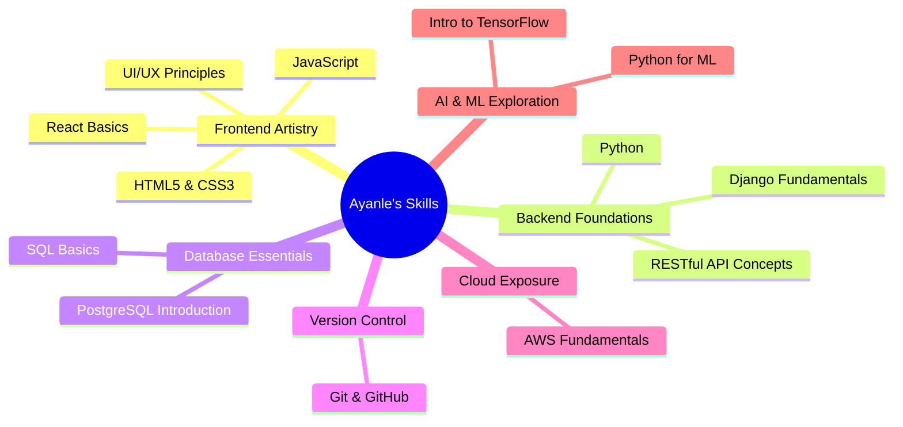

  

  
  
  

---

<h2 align="center">🎨 The Palette of a Digital Artist 🖌️</h2>

  

<h3>🔬 Zoom into the Skillscape</h3>

---

<h2 align="center">🚀 Project Nebula: Where Ideas Take Flight 💫</h2>

  <h3 style="color: #FFD700;">🗣️ Language Alchemist</h3>
  
A fascinating exploration into natural language processing, aiming to bridge human communication with database queries.

  

    Python
    NLP
    SQL
  

  <h3 style="color: #FFD700;">🏀 Court Vision</h3>
  
An innovative approach to visualizing basketball statistics, bringing numbers to life through interactive data representation.

  

    Django
    D3.js
    API Integration
  

  <h3 style="color: #FFD700;">💼 ConnectSphere</h3>
  
A budding project to reimagine how businesses connect with their clients, focusing on intuitive design and seamless interaction.

  

    React
    Node.js
    MongoDB
  

---

<h2 align="center">🏆 Milestones on My Coding Odyssey 🌠</h2>

  

---

<h2 align="center">📊 The Art of Contribution: My GitHub Canvas 🎨</h2>

  
  

---

<h2 align="center">💡 The Innovator's Manifesto: My Code, My Canvas 🖼️</h2>

  

    "In the vast canvas of technology, I am but a young artist, my brushes dipped in lines of code, my palette filled with algorithms and data structures. Each project is a stroke, each commit a touch of color, as I paint my vision of a more connected, intelligent digital world. Though my masterpiece is far from complete, every day I learn, create, and grow, turning challenges into stepping stones and dreams into reality."
  

  
- Ayanle Aideed, Aspiring Digital Renaissance Artist

---

  

