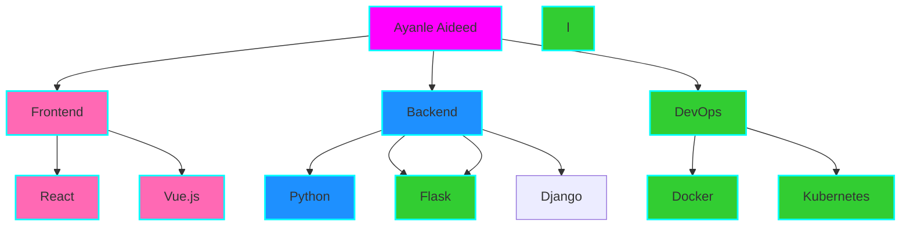

# <div align="center">🌈 Ayanle Aideed's Cosmic Spectrum 🚀</div>

<div align="center">
  
</div>

## 🎨 Color Palette of Skills

<table align="center">
<tr>
<td align="center" width="96">
<a href="#python">

</a>
<br>Python
</td>
<td align="center" width="96">
<a href="#javascript">

</a>
<br>JavaScript
</td>
<td align="center" width="96">
<a href="#rust">

</a>
<br>Rust
</td>
<td align="center" width="96">
<a href="#go">

</a>
<br>Go
</td>
<td align="center" width="96">
<a href="#react">

</a>
<br>React
</td>
<td align="center" width="96">
<a href="#aws">

</a>
<br>AWS
</td>
</tr>
</table>

## 🌟 Stellar Projects

<div align="center">
  <a href="https://github.com/ayanleaideed/cosmic-canvas">
    
  </a>
  <a href="https://github.com/ayanleaideed/neon-nexus">
    
  </a>
</div>

## 🌈 Contribution Prism

<div align="center">
  
</div>

## 🎭 Code Persona

```python
class AyanleAideed:
    def __init__(self):
        self.name = "Ayanle Aideed"
        self.role = "Full Spectrum Developer"
        self.languages = ["Python", "JavaScript", "Rust", "Go"]
        self.interests = ["AI", "Data Visualization", "Cloud Architecture"]
        self.favorite_color = self.generate_rainbow()

    def code(self):
        return "".join([chr(ord(c) + 1) for c in "Hello, World!"])

    def generate_rainbow(self):
        return "🌈"

    def daily_routine(self):
        self.drink_coffee()
        self.write_awesome_code()
        self.learn_new_tech()
        self.repeat()

me = AyanleAideed()
universe.big_bang(me.daily_routine)
```

## 🌠 Skill Constellation

<div align="center">



</div>

## 🚀 Launch Codes (Connect with Me)

<div align="center">
  
[](https://www.linkedin.com/in/ayanle-aideed-118752252/)
[](https://ayanleaideed.github.io/myportfolio/)
[](https://github.com/ayanleaideed)

</div>

## 🎵 Coding Soundtrack

<div align="center">
  <a href="https://open.spotify.com/user/YOUR_SPOTIFY_USER_ID">
    
  </a>
</div>

---

<div align="center">
  
</div>

<div align="center">
  <sub>Created with ❤️ and a sprinkle of stardust by Ayanle Aideed | © 2023 Cosmic Code Creations</sub>
</div>
