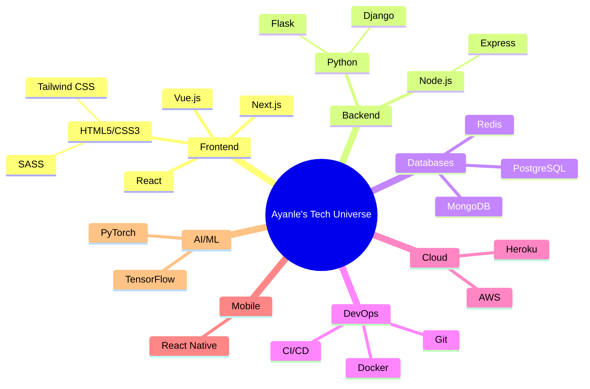

<div align="center">
  
</div>

<div align="center">
  <a href="https://github.com/ayanleaideed" target="_blank">
    
  </a>
  <a href="https://www.linkedin.com/in/ayanle-aideed-118752252/" target="_blank">
    
  </a>
  <a href="mailto:ayanle.aideed@example.com" target="_blank">
    
  </a>
</div>

---

## 🚀 Tech Odyssey

<div align="center">
  


</div>

---

## 💻 Code Artistry

<div align="center">
  
</div>

<div align="left" style="display: flex; justify-content: center; flex-wrap: wrap; gap: 10px;">

```python
# Django REST API
from rest_framework.views import APIView
from rest_framework.response import Response

class InnovationView(APIView):
    def get(self, request):
        return Response({
            "message": "Innovating with Django!"
        })
```

```javascript
// Next.js API Route
export default function handler(req, res) {
  res.status(200).json({ name: 'Ayanle Aideed', skills: ['Next.js', 'React', 'Node.js'] })
}
```

```html
<!-- Tailwind CSS Component -->
<div class="bg-gradient-to-r from-purple-400 via-pink-500 to-red-500 p-6 rounded-lg shadow-lg">
  <h2 class="text-2xl font-bold text-white mb-4">Welcome to My Digital Realm</h2>
  <p class="text-white">Crafting pixels and logic into seamless experiences.</p>
</div>
```

</div>

---

## 🌟 Project Constellation

<div align="center" style="display: flex; justify-content: space-around; flex-wrap: wrap;">

<div style="width: 300px; margin: 10px; padding: 20px; background: linear-gradient(45deg, #FF6B6B, #4ECDC4); border-radius: 10px; color: white;">
  <h3 style="color: #FFD700;">🚀 NexGen E-Commerce</h3>
  <p>A cutting-edge e-commerce platform built with Next.js, Node.js, and MongoDB.</p>
  <div style="margin-top: 10px;">
    <span style="background: #2d3748; padding: 3px 7px; border-radius: 5px; font-size: 12px;">Next.js</span>
    <span style="background: #2d3748; padding: 3px 7px; border-radius: 5px; font-size: 12px;">Node.js</span>
    <span style="background: #2d3748; padding: 3px 7px; border-radius: 5px; font-size: 12px;">MongoDB</span>
  </div>
</div>

<div style="width: 300px; margin: 10px; padding: 20px; background: linear-gradient(45deg, #3498db, #8e44ad); border-radius: 10px; color: white;">
  <h3 style="color: #FFD700;">🤖 AI-Driven Analytics Dashboard</h3>
  <p>Real-time data visualization powered by Django, React, and TensorFlow.</p>
  <div style="margin-top: 10px;">
    <span style="background: #2d3748; padding: 3px 7px; border-radius: 5px; font-size: 12px;">Django</span>
    <span style="background: #2d3748; padding: 3px 7px; border-radius: 5px; font-size: 12px;">React</span>
    <span style="background: #2d3748; padding: 3px 7px; border-radius: 5px; font-size: 12px;">TensorFlow</span>
  </div>
</div>

<div style="width: 300px; margin: 10px; padding: 20px; background: linear-gradient(45deg, #00b894, #00cec9); border-radius: 10px; color: white;">
  <h3 style="color: #FFD700;">📱 Cross-Platform Fitness Tracker</h3>
  <p>A comprehensive fitness app built with React Native and Firebase.</p>
  <div style="margin-top: 10px;">
    <span style="background: #2d3748; padding: 3px 7px; border-radius: 5px; font-size: 12px;">React Native</span>
    <span style="background: #2d3748; padding: 3px 7px; border-radius: 5px; font-size: 12px;">Firebase</span>
    <span style="background: #2d3748; padding: 3px 7px; border-radius: 5px; font-size: 12px;">Redux</span>
  </div>
</div>

</div>

---

## 📊 GitHub Skyline

<div align="center" style="display: flex; justify-content: center; gap: 20px; flex-wrap: wrap;">
   
  
</div>

<div align="center" style="margin-top: 20px;">
  
</div>

---

## 🎓 Academic Pursuits

<div style="background: linear-gradient(45deg, #1e3c72, #2a5298); padding: 20px; border-radius: 10px; color: white;">
  <h3 style="color: #FFD700;">North Dakota State University</h3>
  <p>🖥️ Bachelor of Science in Computer Science</p>
  <p>🚀 Focus: Full Stack Development & Artificial Intelligence</p>
  <p>🏆 Dean's List: Fall 2022, Spring 2023</p>
</div>

---

## 💡 Innovation Pledge

<div style="background: linear-gradient(45deg, #000000, #434343); padding: 20px; border-radius: 10px; color: white; text-align: center;">
  <p style="font-style: italic; font-size: 18px;">"In the realm of ones and zeros, I craft solutions that bridge the gap between human imagination and technological reality. Every line of code is a step towards a more interconnected and intelligent digital future."</p>
  <p style="margin-top: 10px;">- Ayanle Aideed</p>
</div>

---

<div align="center">
  
</div>
