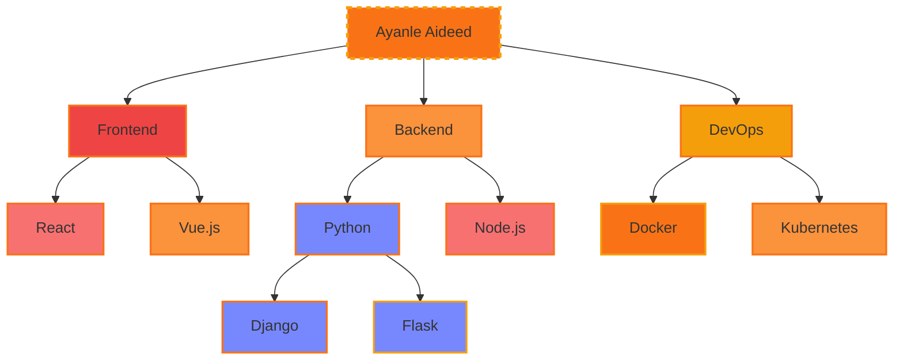

<div align="center" style="background: linear-gradient(135deg, #1e3c72, #2a5298); padding: 20px; border-radius: 10px;">
  <h1 style="color: #FFB6C1; font-size: 3.5rem; font-family: 'Poppins', sans-serif; margin-bottom: 0;">
    Ayanle Aideed's Stellar Tech Portfolio
  </h1>
</div>

<div align="center" style="margin: 20px 0; background: linear-gradient(130deg, #00c6fb, #005bea); padding: 20px; border-radius: 10px;">
  
</div>

<div align="center">
  <a href="https://git.io/typing-svg">
    
  </a>
</div>

## 🚀 Signature Projects

<table>
  <tr>
    <td width="33%" valign="top">
      <h3 align="center">NL to SQL Wizard</h3>
      <br />
      <p align="center">
        
      </p>
      <br />
      <p align="center">
        • Web app for NL to SQL conversion<br>
        • 90% improvement in query accuracy<br>
        • 98% accuracy on 1,000+ queries<br>
        • Positive feedback from 50 beta users
      </p>
      <br />
      <p align="center">
        
        
        
      </p>
    </td>
    <td width="33%" valign="top">
      <h3 align="center">CRM Nexus</h3>
      <br />
      <p align="center">
        
      </p>
      <br />
      <p align="center">
        • Comprehensive CRM solution<br>
        • Complex CRUD operations<br>
        • Real-time data sync for 1000+ users<br>
        • Role-based access control
      </p>
      <br />
      <p align="center">
        
        
        
      </p>
    </td>
    <td width="33%" valign="top">
      <h3 align="center">NBA Stats Hyperdrive</h3>
      <br />
      <p align="center">
        
      </p>
      <br />
      <p align="center">
        • Real-time stats for 450+ NBA players<br>
        • Custom efficiency metrics<br>
        • Interactive D3.js visualizations<br>
        • 40% increase in user engagement
      </p>
      <br />
      <p align="center">
        
        
        
      </p>
    </td>
  </tr>
</table>


## 💼 Professional Experience

<div align="center">

| Position | Company | Duration | Key Achievements |
|:--------:|:-------:|:--------:|:----------------:|
|  | Headstarter AI | Jul 2024 - Present | <div align="left">• Intensive 7-week AI Fellowship Program<br>• Focus on advanced LLMs and RAG applications<br>• Collaborating on innovative AI projects and hackathons<br>• Developing real-world capstone project</div> |
|  | Marvin Windows | May 2023 - Present | <div align="left">• Advanced GUI development with Ignition and Python<br>• Optimized SQL queries, reducing retrieval time by 50%<br>• Improved production precision by 35%<br>• Reduced system downtime by 25%</div> |

</div>
<table>
  <tr>
    <td width="33%" valign="top">
      <h3 align="center">NL to SQL Wizard</h3>
      <br />
      <p align="center">
        
      </p>
      <br />
      <p align="center">
        • Web app for NL to SQL conversion<br>
        • 90% improvement in query accuracy<br>
        • 98% accuracy on 1,000+ queries<br>
        • Positive feedback from 50 beta users
      </p>
      <br />
      <p align="center">
        
        
        
      </p>
    </td>
    <td width="33%" valign="top">
      <h3 align="center">CRM Nexus</h3>
      <br />
      <p align="center">
        
      </p>
      <br />
      <p align="center">
        • Comprehensive CRM solution<br>
        • Complex CRUD operations<br>
        • Real-time data sync for 1000+ users<br>
        • Role-based access control
      </p>
      <br />
      <p align="center">
        
        
        
      </p>
    </td>
    <td width="33%" valign="top">
      <h3 align="center">NBA Stats Hyperdrive</h3>
      <br />
      <p align="center">
        
      </p>
      <br />
      <p align="center">
        • Real-time stats for 450+ NBA players<br>
        • Custom efficiency metrics<br>
        • Interactive D3.js visualizations<br>
        • 40% increase in user engagement
      </p>
      <br />
      <p align="center">
        
        
        
      </p>
    </td>
  </tr>
</table>

## 🧠 Skill Spectrum

<div align="center">



</div>

## 💻 Code Showcase


<!-- <summary>Click to expand</summary> -->

```python
class AyanleAideed:
    def __init__(self):
        self.name = "Ayanle Aideed"
        self.role = "Full Stack Innovator"
        self.language_spoken = ["Python", "JavaScript", "Rust", "Go"]
        self.challenges = []

    def accept_challenge(self, challenge):
        self.challenges.append(challenge)
        return self.innovate(challenge)

    def innovate(self, challenge):
        solution = self.think_outside_galaxy(challenge)
        return f"Innovative solution: {solution}"

    @staticmethod
    def think_outside_galaxy(problem):
        return "Quantum-entangled microservices with AI-driven self-healing capabilities"

me = AyanleAideed()
universe.big_problems.map(me.accept_challenge)
```


## 📊 Performance Metrics

<div align="center">
  
  
</div>

## 🏆 Achievements

<div align="center">


</div>

## 🌟 Featured Repository

<div align="center">

[](https://github.com/ayanleaideed/awesome-project)

</div>

## 🔗 Connect & Collaborate

<div align="center">
  
[](https://www.linkedin.com/in/ayanle-aideed/)
[](https://github.com/ayanleaideed)
[](https://ayanleaideed.com)
[](mailto:ayanle.aideed@example.com)

</div>

---

<div align="center">
  


</div>

<div align="center">
  
</div>
