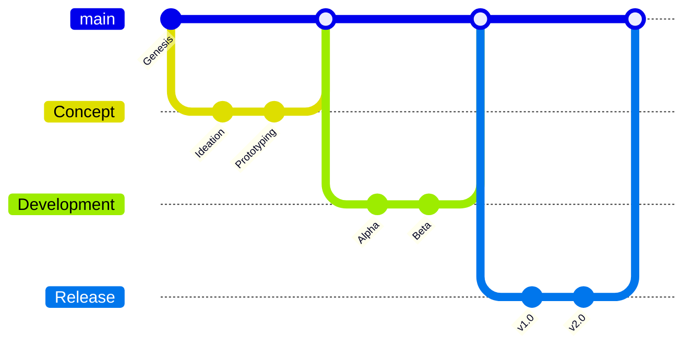
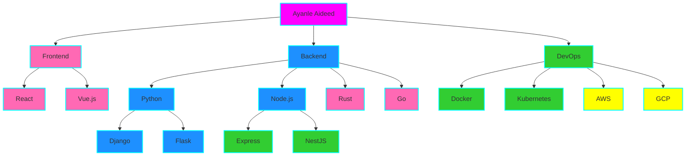

# Welcome to the Code Cosmos of Ayanle Aideed

<div align="center">
  
</div>

## 🌌 Navigate My Code Constellation

<div align="center">
  <a href="#nova-projects">🌟 Nova Projects</a> • 
  <a href="#skill-nebula">🌀 Skill Nebula</a> • 
  <a href="#contribution-quasar">🔥 Contribution Quasar</a> • 
  <a href="#code-dna">🧬 Code DNA</a> • 
  <a href="#connect-across-the-cosmos">🛰️ Connect</a>
</div>

---

## 🎭 Code Shapeshifter

I don't just write code; I orchestrate digital symphonies. My projects are living entities, evolving and adapting to the ever-changing tech landscape. Witness the metamorphosis:



## 🌟 Nova Projects

Behold, the celestial bodies of my coding universe:

<div align="center">

| Project Supernova | Cosmic Impact | Tech Constellation | GitHub Stars |
|:-----------------:|:-------------:|:------------------:|:------------:|
| 🌋 [Volcano](https://github.com/ayanleaideed/volcano) | Erupting with scalability | `Python` `Microservices` `AWS` |  |
| 🌊 [Tsunami](https://github.com/ayanleaideed/tsunami) | Waves of data processing | `Rust` `Big Data` `Apache Kafka` |  |
| 🌪️ [Cyclone](https://github.com/ayanleaideed/cyclone) | Swirling AI innovations | `TensorFlow` `PyTorch` `CUDA` |  |

</div>

## 🌀 Skill Nebula

My skills are not just listed; they're an interactive cosmic dance:

<div align="center">
  
</div>

<details>
<summary>🔬 Zoom into the Skill Microcosm</summary>

<div align="center">



</div>

</details>

## 🔥 Contribution Quasar

Watch as my contributions ignite the GitHub galaxy:

<div align="center">
  
</div>

<div align="center">
  
</div>

## 📊 Code by Numbers

<div align="center">

| Metric | Count |
|:------:|:-----:|
| 💻 Total Repositories |  |
| 🌟 Total Stars |  |
| 🍴 Total Forks |  |
| 👥 Followers |  |

</div>

## 🧬 Code DNA

My coding style is not just a preference; it's encoded in my digital DNA:

```python
class AyanleAideed:
    def __init__(self):
        self.name = "Ayanle Aideed"
        self.role = "Full Stack Innovator"
        self.language_spoken = ["Python", "JavaScript", "Rust", "Go"]
        self.challenges = []

    def accept_challenge(self, challenge):
        self.challenges.append(challenge)
        return self.innovate(challenge)

    def innovate(self, challenge):
        solution = self.think_outside_galaxy(challenge)
        return f"Innovative solution: {solution}"

    @staticmethod
    def think_outside_galaxy(problem):
        return "Quantum-entangled microservices with AI-driven self-healing capabilities"

me = AyanleAideed()
universe.big_problems.map(me.accept_challenge)
```

## 📈 Language Time Travel

<div align="center">
  
</div>

## 🛰️ Connect Across the Cosmos

Let's align our coding constellations:

<div align="center">
  
[](https://www.linkedin.com/in/ayanle-aideed-118752252/)
[](https://ayanleaideed.github.io/myportfolio/)
[](https://github.com/ayanleaideed)

</div>

---

<div align="center">
  
</div>

<div align="center">
  <sub>Created with cosmic code and intergalactic imagination by Ayanle Aideed</sub>
</div>
