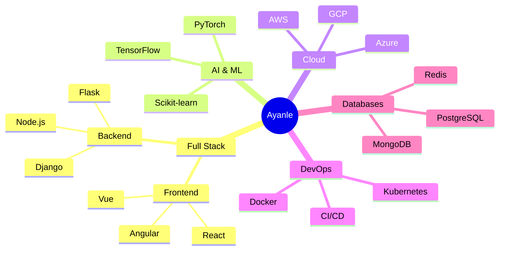

# 
🌟 Ayanle Aideed's Neon Nexus 🌟

  

  
| [🏆 Projects](#-signature-projects) | [🧬 Skills](#-skill-genome) | [📊 Stats](#-neural-network-activity) | [🔗 Connect](#-quantum-entanglement-links) |

---

## 🎨 Tech Palette

       

---

## 🚀 Signature Projects

<table>
  <tr>
    <td width="50%">
      <h3 align="center">Quantum Entanglement Messenger</h3>
      
  
        
        
      

      
<strong>Quantum Computing | React | Node.js</strong> - A revolutionary messaging app leveraging quantum entanglement for instantaneous, secure communication across any distance.

    </td>
    <td width="50%">
      <h3 align="center">AI-Powered Climate Optimizer</h3>
      

        
        
      

      
<strong>Python | TensorFlow | AWS</strong> - An AI system that analyzes global climate data to provide actionable strategies for environmental improvement on a planetary scale.

    </td>
  </tr>
  <tr>
    <td width="50%">
      <h3 align="center">Neuro-Linguistic Code Generator</h3>
      

        
        
      

      
<strong>GPT-3 | React | Flask</strong> - An advanced AI tool that converts natural language descriptions into functional code across multiple programming languages.

    </td>
    <td width="50%">
      <h3 align="center">Holographic Data Visualizer</h3>
      

        
        
      

      
<strong>Three.js | WebGL | D3.js</strong> - A cutting-edge data visualization platform that creates interactive, holographic representations of complex datasets.

    </td>
  </tr>
</table>

---

## 🧬 Skill Genome

---

## 📊 Neural Network Activity

  
  

  

---

## 🔗 Quantum Entanglement Links

  

---

## 🌌 Venture Into The Code Cosmos 🌌

