# <div align="center">Ayanle Aideed's Cutting-Edge Tech Portfolio - 2024</div>

<div align="center">
  
</div>

<div align="center">
  
[](https://git.io/typing-svg)

</div>

## 🚀 Signature Projects

<div align="center" style="display: flex; justify-content: space-around; flex-wrap: wrap;">

<div class="project-card" style="width: 30%; min-width: 300px; margin: 10px; padding: 20px; background: rgba(255, 82, 82, 0.1); border-radius: 10px; transition: all 0.3s ease; cursor: pointer;">
  <h3 style="color: #FF5252;">NL to SQL Wizard</h3>
  <p style="text-align: left;">• Web app for NL to SQL conversion<br>• 90% improvement in query accuracy<br>• 98% accuracy on 1,000+ queries<br>• Positive feedback from 50 beta users</p>
  <div style="margin-top: 10px;">
    
    
    
  </div>
</div>

<div class="project-card" style="width: 30%; min-width: 300px; margin: 10px; padding: 20px; background: rgba(255, 82, 82, 0.1); border-radius: 10px; transition: all 0.3s ease; cursor: pointer;">
  <h3 style="color: #FF5252;">CRM Nexus</h3>
  <p style="text-align: left;">• Comprehensive CRM solution<br>• Complex CRUD operations<br>• Real-time data sync for 1000+ users<br>• Role-based access control</p>
  <div style="margin-top: 10px;">
    
    
    
  </div>
</div>

<div class="project-card" style="width: 30%; min-width: 300px; margin: 10px; padding: 20px; background: rgba(255, 82, 82, 0.1); border-radius: 10px; transition: all 0.3s ease; cursor: pointer;">
  <h3 style="color: #FF5252;">NBA Stats Hyperdrive</h3>
  <p style="text-align: left;">• Real-time stats for 450+ NBA players<br>• Custom efficiency metrics<br>• Interactive D3.js visualizations<br>• 40% increase in user engagement</p>
  <div style="margin-top: 10px;">
    
    
    
  </div>
</div>

</div>

<style>
  .project-card:hover {
    transform: scale(1.05);
    box-shadow: 0 10px 20px rgba(255, 82, 82, 0.2);
    z-index: 1;
  }
  .project-card:not(:hover) {
    filter: blur(1px);
  }
</style>

## 🧠 Skill Spectrum

```mermaid
graph TD
    A[Ayanle Aideed]:::root --> B[Frontend]:::frontend
    A --> C[Backend]:::backend
    A --> D[DevOps]:::devops
    A --> E[AI & ML]:::aiml
    B --> F[React]:::frontend
    B --> G[Vue.js]:::frontend
    B --> H[HTML/CSS]:::frontend
    C --> I[Python]:::backend
    C --> J[Node.js]:::backend
    C --> K[Django]:::backend
    C --> L[Flask]:::backend
    D --> M[Docker]:::devops
    D --> N[Kubernetes]:::devops
    D --> O[CI/CD]:::devops
    E --> P[TensorFlow]:::aiml
    E --> Q[PyTorch]:::aiml
    E --> R[NLP]:::aiml
    E --> S[Computer Vision]:::aiml

    classDef root fill:#FF5252,stroke:#FF8080,stroke-width:4px,color:#FFF,font-weight:bold
    classDef frontend fill:#FFB3BA,stroke:#FF69B4,stroke-width:2px,color:#000
    classDef backend fill:#BAFFC9,stroke:#00CED1,stroke-width:2px,color:#000
    classDef devops fill:#BAE1FF,stroke:#1E90FF,stroke-width:2px,color:#000
    classDef aiml fill:#FFFFBA,stroke:#FFD700,stroke-width:2px,color:#000

    linkStyle default stroke-width:2px,fill:none,stroke:#FF5252

    style A font-size:20px
    style B,C,D,E font-size:16px
    style F,G,H,I,J,K,L,M,N,O,P,Q,R,S font-size:14px

%%{init: {'theme': 'dark', 'themeVariables': { 'primaryColor': '#FF5252', 'primaryTextColor': '#fff', 'primaryBorderColor': '#FF8080', 'lineColor': '#F8B229', 'secondaryColor': '#006100', 'tertiaryColor': '#4B0082'}}}%%

```

<div align="center">



</div>

## 💼 Professional Experience

<details>
<summary><b>Software Engineering Fellow at Headstarter AI</b> (Jul 2024 - Present)</summary>

- Participating in an intensive 7-week AI Fellowship Program
- Focus on advanced LLMs and RAG applications
- Collaborating on innovative AI projects and hackathons
- Developing a capstone project addressing real-world challenges
- Enhancing skills in cutting-edge AI technologies and industry-standard workflows
</details>

<details>
<summary><b>Systems Automation Intern at Marvin Windows</b> (May 2023 - Present)</summary>

- Engineered advanced GUIs with Ignition and Python for event automation
- Optimized SQL queries, reducing retrieval time by 50%
- Improved production precision and adaptability by 35%
- Reduced system downtime by 25% through quick bug fixes and failure resolution
</details>

## 💻 Code Persona

<div align="center">
  <details>
  <summary><b>Click to toggle between Code Personas</b></summary>

  ```python
  class AyanleAideed:
      def __init__(self):
          self.name = "Ayanle Aideed"
          self.role = "Full Spectrum Developer"
          self.languages = ["Python", "JavaScript", "Rust", "Go"]
          self.interests = ["AI", "Data Visualization", "Cloud Architecture"]
          self.favorite_color = self.generate_rainbow()

      def code(self):
          return "".join([chr(ord(c) + 1) for c in "Hello, World!"])

      def generate_rainbow(self):
          return "🌈"

      def daily_routine(self):
          self.drink_coffee()
          self.write_awesome_code()
          self.learn_new_tech()
          self.repeat()

  me = AyanleAideed()
  universe.big_bang(me.daily_routine)
  ```

  ```python
  class AyanleAideed:
      def __init__(self):
          self.name = "Ayanle Aideed"
          self.role = "Full Stack Innovator"
          self.language_spoken = ["Python", "JavaScript", "Rust", "Go"]
          self.challenges = []

      def accept_challenge(self, challenge):
          self.challenges.append(challenge)
          return self.innovate(challenge)

      def innovate(self, challenge):
          solution = self.think_outside_galaxy(challenge)
          return f"Innovative solution: {solution}"

      @staticmethod
      def think_outside_galaxy(problem):
          return "Quantum-entangled microservices with AI-driven self-healing capabilities"

  me = AyanleAideed()
  universe.big_problems.map(me.accept_challenge)
  ```

  </details>
</div>

## 📊 Performance Metrics

<div align="center">
  
  
</div>

## 🔗 Connect & Collaborate

<div align="center">
  
[](https://www.linkedin.com/in/ayanle-aideed/)
[](https://github.com/ayanleaideed)
[](https://ayanleaideed.com)
[](mailto:ayanle.aideed@example.com)

</div>

---

<div align="center">
  


</div>

<div align="center">
  
</div>
