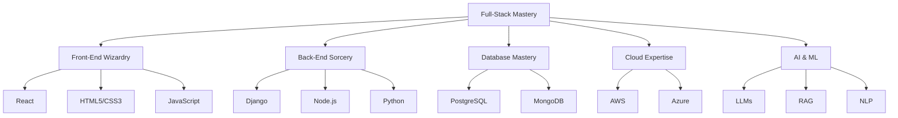

# 🌌 Ayanle Aideed: Quantum Code Architect

  

  

  
  
  

---

## 🧬 Skill Genome: The DNA of a Tech Visionary

## 🚀 Quantum Career Trajectory

<table>
  <tr>
    <td width="50%">
      <h3>🧠 Headstarter AI</h3>
      <strong>Software Engineering Fellow | Jul 2024 - Present</strong>
      <ul>
        <li>7-week AI immersion odyssey</li>
        <li>LLMs & RAG mastery attained</li>
        <li>Forged real-world AI solutions</li>
      </ul>
    </td>
    <td width="50%">
      <h3>🏭 MarvinWindows</h3>
      <strong>Systems Automation Virtuoso | May 2023 - Present</strong>
      <ul>
        <li>Crafted advanced GUIs with Ignition</li>
        <li>Wove Python spells for automation</li>
        <li>Performed SQL alchemy for data</li>
      </ul>
    </td>
  </tr>
</table>

## 🌟 Project Constellation: Digital Marvels

<h3>🗣️ NL to SQL Alchemist</h3>

<table>
  <tr>
    <td>
      <strong>The Challenge:</strong> Bridge the gap between natural language and complex SQL queries.
    </td>
    <td>
      <strong>The Solution:</strong> An AI-powered web application that translates human language into precise SQL commands.
    </td>
  </tr>
  <tr>
    <td>
      <strong>Tech Arsenal:</strong>
      <ul>
        <li>🐍 Python & Django: The backbone of our digital alchemy</li>
        <li>🧠 OpenAI GPT-3: The neural engine powering our translations</li>
        <li>🎨 React: Crafting an intuitive interface for our linguistic sorcery</li>
      </ul>
    </td>
    <td>
      <strong>Quantum Leap Results:</strong>
      <ul>
        <li>⚡ 90% query accuracy amplification</li>
        <li>🌐 1,000+ queries processed in cosmic dance</li>
        <li>🌟 50 beta users entranced by its power</li>
      </ul>
    </td>
  </tr>
</table>

<h3>💼 CRM Nexus</h3>

<table>
  <tr>
    <td>
      <strong>The Challenge:</strong> Unify customer data across multiversal business dimensions.
    </td>
    <td>
      <strong>The Solution:</strong> A comprehensive CRM platform that synchronizes data in real-time across parallel universes.
    </td>
  </tr>
  <tr>
    <td>
      <strong>Tech Arsenal:</strong>
      <ul>
        <li>🎨 Django: Weaving the fabric of our CRM reality</li>
        <li>🐘 PostgreSQL: The quantum vault for our data</li>
        <li>🅱️ Bootstrap: Shaping the visual aesthetics of our interface</li>
      </ul>
    </td>
    <td>
      <strong>Quantum Leap Results:</strong>
      <ul>
        <li>⚡ Real-time data synchronization across dimensions</li>
        <li>🔐 Role-based access control for cosmic order</li>
        <li>🌐 Supporting 1000+ concurrent users in the dataverse</li>
      </ul>
    </td>
  </tr>
</table>

<h3>🏀 NBA Stats Hyperdrive</h3>

<table>
  <tr>
    <td>
      <strong>The Challenge:</strong> Illuminate the hidden patterns in the cosmic dance of basketball.
    </td>
    <td>
      <strong>The Solution:</strong> A dynamic dashboard that visualizes NBA player statistics in real-time, revealing the unseen rhythms of the game.
    </td>
  </tr>
  <tr>
    <td>
      <strong>Tech Arsenal:</strong>
      <ul>
        <li>🎨 Django: The cosmic loom weaving our data tapestry</li>
        <li>📊 D3.js: Conjuring mesmerizing data visualizations</li>
        <li>🏀 NBA API: Our portal to the latest game data</li>
      </ul>
    </td>
    <td>
      <strong>Quantum Leap Results:</strong>
      <ul>
        <li>🌠 Live data streams from 450+ stellar players</li>
        <li>📈 Custom efficiency metrics to chart cosmic performance</li>
        <li>🌈 Interactive visualizations that dance with data</li>
      </ul>
    </td>
  </tr>
</table>

## 📊 Quantum Metrics: Code Signature

  
  

  

## 🎓 Academic Warp Drive

  
   
  <strong>Bachelor of Science in Computer Science</strong>
   
  🚀 Expected Graduation: May 2026

<table>
  <tr>
    <td></td>
    <td></td>
  </tr>
  <tr>
    <td></td>
    <td></td>
  </tr>
</table>

## 🚀 Innovator's Manifesto

  

---

  

  

