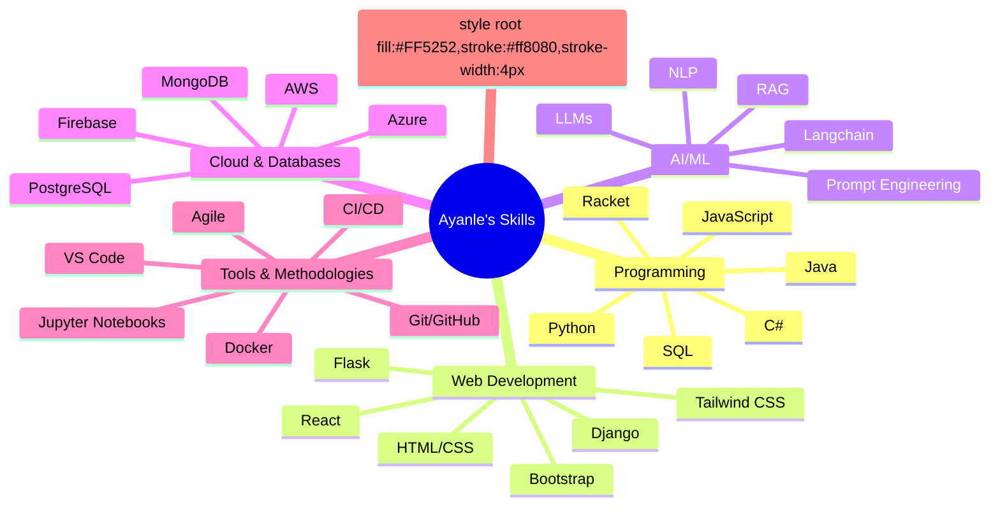

# 
Ayanle Aideed's Innovative Tech Portfolio

  

  

## 🚀 Signature Projects

| Project | Description | Technologies |
|:-------:|:-----------:|:------------:|
|  | Web app for natural language to SQL conversion with 98% accuracy |    |
|  | Comprehensive CRM solution supporting 1000+ concurrent users |    |
|  | Real-time NBA statistics platform with custom visualizations |    |
|  | Advanced GUI with event automation for production systems |    |

## 🧠 Skill Spectrum

## 📊 Performance Metrics

  
  

  

## 🔗 Connect & Collaborate

  

---

  

  

