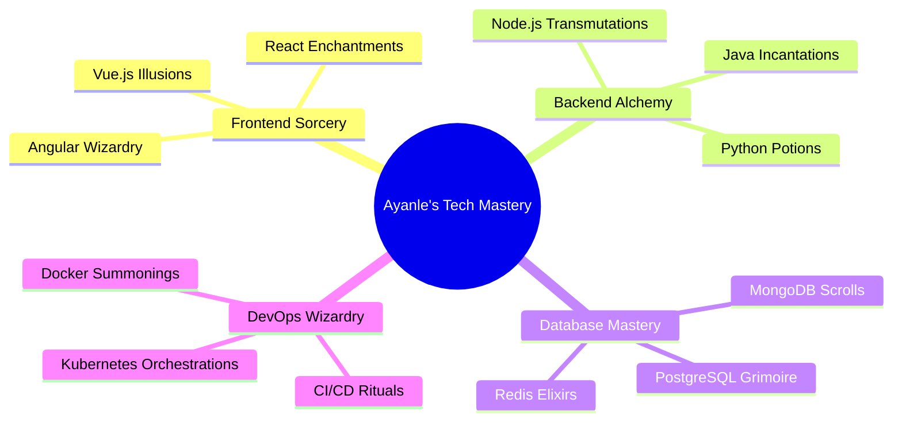

  

  
  
  

  
  

---

<h2 align="center">🌈 Tech Spectrum 🌈</h2>

---

<h2 align="center">🚀 Stellar Projects 🚀</h2>

  <table>
    <tr>
      <td width="50%">
        <h3 align="center">Nebula Network</h3>
        
  
          
           
           
          

              
            
          

          
<strong>React, Node.js, GraphQL, Neo4j</strong> - A cutting-edge social platform leveraging graph database for intelligent connections.

        

      </td>
      <td width="50%">
        <h3 align="center">Quantum Quill</h3>
        
  
          
           
           
          

              
            	
          

           
<strong>Python, TensorFlow, Flask, MongoDB</strong> - AI-powered writing assistant using quantum computing principles for creative text generation.

        

	    </td>
    </tr>
  </table>

---

<h2 align="center">⚡ Skill Arsenal ⚡</h2>

  

---

  

---

<h2 align="center">📊 GitHub Analytics 📊</h2>

  
  

  

---

<h2 align="center">🌟 Let's Connect 🌟</h2>

  
  
  

  

