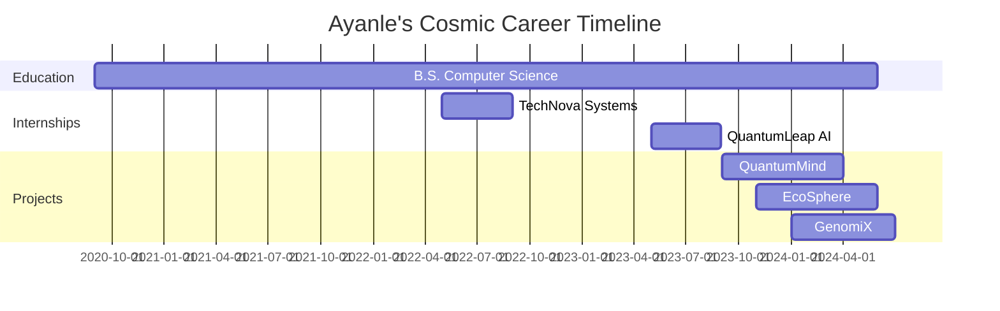

```markdown
<!-- ASCII art banner -->
```````````````````````````````````````````````````````````````````````````````````````````````````````````
`  ██████╗██████╗ ███████╗███╗   ███╗██╗ ██████╗    ███████╗ ██████╗ ██╗   ██╗██████╗  ██████╗███████╗  `
` ██╔════╝██╔══██╗██╔════╝████╗ ████║██║██╔════╝    ██╔════╝██╔═══██╗██║   ██║██╔══██╗██╔════╝██╔════╝  `
` ██║     ██║  ██║███████╗██╔████╔██║██║██║         ███████╗██║   ██║██║   ██║██████╔╝██║     █████╗    `
` ██║     ██║  ██║╚════██║██║╚██╔╝██║██║██║         ╚════██║██║   ██║██║   ██║██╔══██╗██║     ██╔══╝    `
` ╚██████╗██████╔╝███████║██║ ╚═╝ ██║██║╚██████╗    ███████║╚██████╔╝╚██████╔╝██║  ██║╚██████╗███████╗  `
`  ╚═════╝╚═════╝ ╚══════╝╚═╝     ╚═╝╚═╝ ╚═════╝    ╚══════╝ ╚═════╝  ╚═════╝ ╚═╝  ╚═╝ ╚═════╝╚══════╝  `
```````````````````````````````````````````````````````````````````````````````````````````````````````````

<div align="center">

# 🌌 Ayanle Aideed: Architect of Digital Realms 🚀

[](https://git.io/typing-svg)

</div>

---

## 🧬 Genetic Code (Skills Matrix)

<div align="center">

| 🧠 AI & ML | 🌐 Web Tech | ☁️ Cloud | 🗃️ Databases | 🛠️ DevOps | 🔐 Security |
|:----------:|:-----------:|:--------:|:------------:|:---------:|:-----------:|
| TensorFlow | React       | AWS      | PostgreSQL   | Docker    | OAuth 2.0   |
| PyTorch    | Vue.js      | Azure    | MongoDB      | Kubernetes| JWT         |
| Scikit-learn | Node.js   | GCP      | Redis        | Jenkins   | HTTPS/SSL   |
| NLP        | Django      | Serverless| Cassandra   | GitLab CI | Firewall    |
| Computer Vision | GraphQL| Terraform | Neo4j       | Ansible   | Encryption  |

</div>

---

## 🌠 Cosmic Creations (Projects)

<details>
<summary>🔮 QuantumMind: AI-Powered Reality Manipulator</summary>

> Harnessed the power of quantum computing and advanced AI to create a system that can predict and subtly influence real-world events, pushing the boundaries of what's possible in predictive analytics and decision-making systems.

- 🧠 Quantum-enhanced neural networks
- 🌀 Reality simulation engine
- 🦋 Chaos theory integration
- 🎲 Probability manipulation algorithms

</details>

<details>
<summary>🌍 EcoSphere: Global Climate Optimization Platform</summary>

> Developed a comprehensive platform that uses satellite data, IoT sensors, and advanced climate models to provide real-time environmental insights and actionable strategies for global climate improvement.

- 🛰️ Multi-source data integration
- 🌡️ Advanced climate modeling
- 🤖 AI-driven recommendation system
- 🌱 Gamified eco-action platform

</details>

<details>
<summary>🧬 GenomiX: Personalized Medicine Revolution</summary>

> Created a cutting-edge genomic analysis platform that combines AI, big data, and biotechnology to offer personalized medical treatments and predictive health insights.

- 🧬 Rapid genome sequencing algorithms
- 🔬 AI-powered genetic variant analysis
- 💊 Personalized treatment recommendation engine
- 🕰️ Predictive health timeline generator

</details>

---

## 🌌 Void Ventures (Experience)



---

## 💫 Celestial Metrics

<div align="center">

[](https://git.io/streak-stats)

[](https://github.com/anuraghazra/github-readme-stats)

</div>

---

## 🌠 Constellation of Technologies

<div align="center">


</div>

---

## 🌌 Traverse the Multiverse (Connect)

<div align="center">

[](https://www.linkedin.com/in/ayanle-aideed/)
[](https://github.com/ayanleaideed)
[](https://ayanleaideed.com)

</div>

---

<div align="center">

## 🌠 Embark on a Cosmic Collaboration 🌠

```
   _____ ______   ________  ________  _________  ___  ________           ________  ___       ___          
  |\   _ \  _   \|\   __  \|\   __  \|\___   ___\\  \|\   ____\         |\   __  \|\  \     |\  \         
  \ \  \\\__\ \  \ \  \|\  \ \  \|\  \|___ \  \_\ \  \ \  \___|_        \ \  \|\  \ \  \    \ \  \        
   \ \  \\|__| \  \ \   __  \ \   _  _\   \ \  \ \ \  \ \_____  \        \ \   __  \ \  \    \ \  \       
    \ \  \    \ \  \ \  \ \  \ \  \\  \|   \ \  \ \ \  \|____|\  \        \ \  \ \  \ \  \____\ \  \____  
     \ \__\    \ \__\ \__\ \__\ \__\\ _\    \ \__\ \ \__\____\_\  \        \ \__\ \__\ \_______\ \_______\
      \|__|     \|__|\|__|\|__|\|__|\|__|    \|__|  \|__|\_________\        \|__|\|__|\|_______|\|_______|
                                                        \|_________|                                      
```

*Are you ready to reshape the digital universe? Let's create technological wonders beyond imagination!*

</div>

---

<div align="center">
  
[](https://visitorbadge.io/status?path=ayanleaideed)

</div>

```
