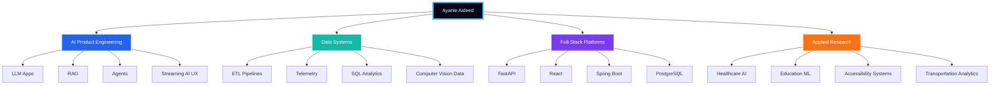

  
  
  

  
  
  

## 

<table width="100%">
  <tr>
    <td width="58%" valign="top">
      <h3>Builder Profile</h3>
      

        I am <strong>Ayanle Aideed</strong>, a Software Engineer and Computer Science student at
        <strong>North Dakota State University</strong> building across AI products, full-stack platforms,
        data engineering, computer vision, and applied research.
      

      

        My favorite work lives at the edge of usefulness: low-latency AI experiences, clean backend APIs,
        reliable data pipelines, and research systems that become real tools.
      

      

        
        
        
      

    </td>
    <td width="42%" valign="top">
      <h3>2026 Signal</h3>
      <table>
        <tr><td></td></tr>
        <tr><td></td></tr>
        <tr><td></td></tr>
        <tr><td></td></tr>
        <tr><td></td></tr>
      </table>
    </td>
  </tr>
</table>

## 

<table>
  <tr>
    <td align="center" width="25%">
       
      Fault-tolerant ETL into normalized SQL schemas
    </td>
    <td align="center" width="25%">
       
      Dropout prediction modeling on TACC Stampede3
    </td>
    <td align="center" width="25%">
       
      Distributed HPC job and data-loading improvements
    </td>
    <td align="center" width="25%">
       
      Manufacturing recut-verification automation
    </td>
  </tr>
  <tr>
    <td align="center" width="25%">
       
      YOLOv8 multiprocessing and batch inference
    </td>
    <td align="center" width="25%">
       
      Factory automation interfaces with validation
    </td>
    <td align="center" width="25%">
       
      C#, SQL Server, Azure, React dashboard work
    </td>
    <td align="center" width="25%">
       
      Fairness-focused education ML feature engineering
    </td>
  </tr>
</table>

## 

<table>
  <tr>
    <td width="50%" valign="top">
      <h3>AlphaCore Terminal</h3>
      
      
Bloomberg Terminal-inspired platform for market data, analytics, watchlists, instruments, and clean service-layer backend design.

      

        
        
        
        
      

    </td>
    <td width="50%" valign="top">
      <h3>NL-to-SQL Platform</h3>
      
      
Converts natural-language questions into SQL across multiple schemas using retrieval, role-based access, and LLM query generation.

      

        
        
        
        
      

    </td>
  </tr>
  <tr>
    <td width="50%" valign="top">
      <h3>Voice-Controlled Autonomous Robot</h3>
      
      
RC robot with obstacle detection, voice control, ultrasonic fallback, and Gemini-powered multimodal reasoning for navigation.

      

        
        
        
        
      

    </td>
    <td width="50%" valign="top">
      <h3>Production FastAPI Template</h3>
      
      
Open-source backend template with async PostgreSQL, Alembic migrations, CI/CD, observability, and deployment-focused structure.

      

        
        
        
        
      

    </td>
  </tr>
</table>

## 

<table>
  <tr>
    <th>Track</th>
    <th>Status</th>
    <th>Visual Signal</th>
    <th>Stack</th>
  </tr>
  <tr>
    <td><strong>AI Interview Platform</strong></td>
    <td></td>
    <td></td>
    <td>FastAPI · React · OpenAI · Google Models</td>
  </tr>
  <tr>
    <td><strong>Transportation Intelligence</strong></td>
    <td></td>
    <td></td>
    <td>Python · SQL · YOLOv8 · OCR</td>
  </tr>
  <tr>
    <td><strong>Market Data Terminal</strong></td>
    <td></td>
    <td></td>
    <td>Java · Spring Boot · PostgreSQL</td>
  </tr>
  <tr>
    <td><strong>Healthcare / Accessibility AI</strong></td>
    <td></td>
    <td></td>
    <td>Python · LangChain · LoRA · HPC</td>
  </tr>
</table>

## 

<table>
  <tr>
    <th>Role</th>
    <th>Organization</th>
    <th>Timeline</th>
    <th>Impact</th>
  </tr>
  <tr>
    <td align="center"></td>
    <td align="center"><strong>Finale</strong> Remote Startup</td>
    <td align="center">Jan 2026 - Present</td>
    <td>Built AI interview simulation features with Python, FastAPI, React, live OpenAI/Google model integrations, session state APIs, prompt orchestration, and streaming responses.</td>
  </tr>
  <tr>
    <td align="center"></td>
    <td align="center"><strong>ND DOT / NDSU UGPTI</strong> Fargo, ND</td>
    <td align="center">Aug 2025 - Present</td>
    <td>Built ETL for 100K+ crash records, real-time snowplow telemetry ingestion, OCR pipelines for DOT PDFs, and optimized YOLOv8 traffic-video processing by 30%.</td>
  </tr>
  <tr>
    <td align="center"></td>
    <td align="center"><strong>UT Austin / TACC</strong> Austin, TX</td>
    <td align="center">May 2025 - Aug 2025</td>
    <td>Trained dropout prediction models on 100K+ student records, reached 93% accuracy, reduced training time by about 70%, and improved fairness features.</td>
  </tr>
  <tr>
    <td align="center"></td>
    <td align="center"><strong>North Dakota State University</strong> Fargo, ND</td>
    <td align="center">Sep 2024 - May 2025</td>
    <td>Co-authored CareBuddy AI, an ASSETS'25 ACM multi-agent LLM system, and built healthcare LLM pipelines with LoRA, LangChain, and HPC workflows.</td>
  </tr>
  <tr>
    <td align="center"></td>
    <td align="center"><strong>Marvin Windows</strong> Fargo, ND</td>
    <td align="center">Aug 2023 - May 2024</td>
    <td>Built factory automation interfaces, reduced operator errors by 35%, saved about $100K annually, and shipped dashboards that cut report generation time by 50%.</td>
  </tr>
</table>

## 

<table align="center">
  <tr>
    <th>Core Languages</th>
    <th>Backend & Data</th>
    <th>AI / ML</th>
    <th>Infra & Cloud</th>
  </tr>
  <tr>
    <td align="center" valign="top">
        
      
    </td>
    <td align="center" valign="top">
        
      
      
    </td>
    <td align="center" valign="top">
        
      
      
    </td>
    <td align="center" valign="top">
        
      
      
    </td>
  </tr>
</table>

<h3>Power Stack Heatmap</h3>

<table>
  <tr>
    <td></td>
    <td></td>
    <td></td>
  </tr>
  <tr>
    <td></td>
    <td></td>
    <td></td>
  </tr>
</table>

## 

```mermaid
flowchart TD
    A[Ayanle Aideed] --> B[AI Product Engineering]
    A --> C[Data Systems]
    A --> D[Full-Stack Platforms]
    A --> E[Applied Research]

    B --> B1[LLM Apps]
    B --> B2[RAG]
    B --> B3[Agents]
    B --> B4[Streaming AI UX]

    C --> C1[ETL Pipelines]
    C --> C2[Telemetry]
    C --> C3[SQL Analytics]
    C --> C4[Computer Vision Data]

    D --> D1[FastAPI]
    D --> D2[React]
    D --> D3[Spring Boot]
    D --> D4[PostgreSQL]

    E --> E1[Healthcare AI]
    E --> E2[Education ML]
    E --> E3[Accessibility Systems]
    E --> E4[Transportation Analytics]

    style A fill:#020617,stroke:#38bdf8,stroke-width:4px,color:#ffffff
    style B fill:#2563eb,stroke:#bfdbfe,stroke-width:2px,color:#ffffff
    style C fill:#14b8a6,stroke:#ccfbf1,stroke-width:2px,color:#ffffff
    style D fill:#7c3aed,stroke:#ddd6fe,stroke-width:2px,color:#ffffff
    style E fill:#f97316,stroke:#fed7aa,stroke-width:2px,color:#ffffff
```

## 

 

  

  

## 

| AI, Data, and Systems | Product and Full Stack |
|:---:|:---:|
|  |  |
|  |  |

## 

<table>
  <tr>
    <td width="20%" align="center"> Streaming model interfaces, prompt flows, evaluation loops</td>
    <td width="20%" align="center"> ETL, OCR, telemetry, normalized SQL schemas</td>
    <td width="20%" align="center"> HPC training, fairness features, education and health AI</td>
    <td width="20%" align="center"> FastAPI, Spring Boot, Django, auth, service architecture</td>
    <td width="20%" align="center"> Manufacturing dashboards, validation tools, operator workflows</td>
  </tr>
</table>

  
<strong>Expanded Technical Snapshot</strong>

   
  <table>
    <tr>
      <td><strong>Education</strong></td>
      <td>B.S. Computer Science, minors in AI, Robotics, and Statistics, expected May 2027</td>
    </tr>
    <tr>
      <td><strong>Coursework</strong></td>
      <td>Data Structures and Algorithms, Database Systems, Operating Systems, Artificial Intelligence, Linear Algebra, Probability and Statistics, Machine Learning, Robotics</td>
    </tr>
    <tr>
      <td><strong>Affiliations</strong></td>
      <td>NSF REU Scholar, ASSETS'25 ACM publication contributor, Dean's List, CodePath Fellow, NSBE, ACM</td>
    </tr>
  </table>

---

  <strong>Open to Software Engineering, AI/ML Engineering, Data Engineering, Backend Engineering, and Applied Research opportunities.</strong>

  
  

