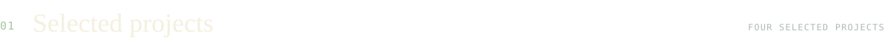
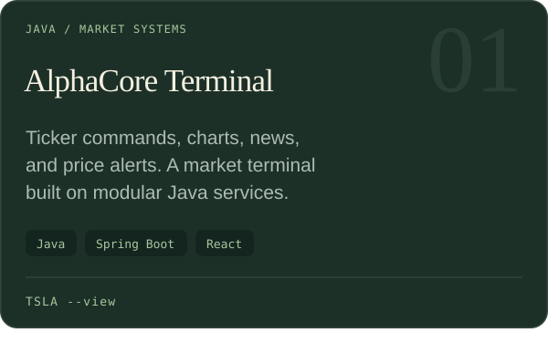
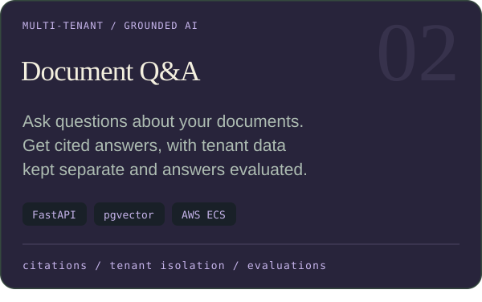
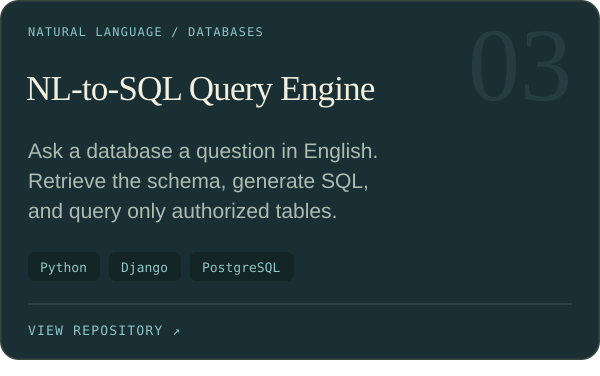
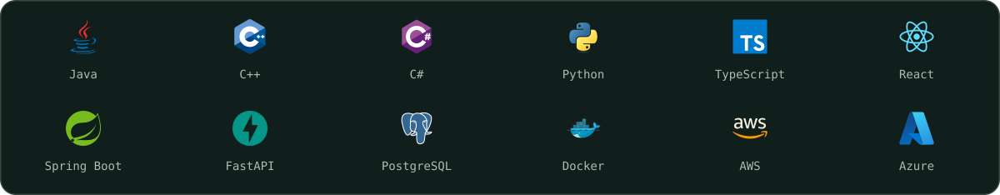
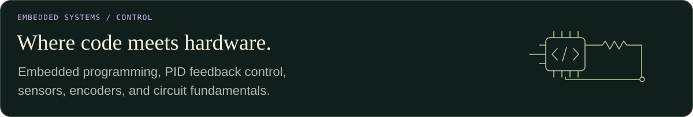
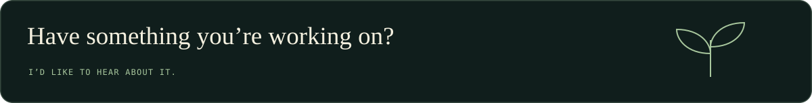

<p>
<picture>
<source media="(max-width: 600px) and (prefers-color-scheme: dark)" srcset="./assets/profile-041998cd16/hero-dark-mobile.svg" />
<source media="(max-width: 600px) and (prefers-color-scheme: light)" srcset="./assets/profile-041998cd16/hero-light-mobile.svg" />
<source media="(prefers-color-scheme: dark)" srcset="./assets/profile-041998cd16/hero-dark.svg" />
<source media="(prefers-color-scheme: light)" srcset="./assets/profile-041998cd16/hero-light.svg" />

</picture>
</p>

<p align="center">
<a href="https://ayanlea-tech.vercel.app/"><strong>PORTFOLIO ↗</strong></a> &nbsp; / &nbsp;
<a href="https://linkedin.com/in/ayanleaideed"><strong>LINKEDIN ↗</strong></a> &nbsp; / &nbsp;
<a href="https://github.com/Ayanleaideed?tab=repositories"><strong>REPOSITORIES ↗</strong></a>
</p>

**Computer Science at NDSU.** I work on backend APIs, data pipelines, and AI applications, with side projects in embedded systems and feedback control.

**Incoming Systems Engineering Co-op · RTX (Raytheon), space and infrastructure**  
<sub>Currently ND DOT / UGPTI · Previously Finale, TACC, NDSU research, and Marvin Windows</sub>

<p>
<picture>
<source media="(max-width: 600px) and (prefers-color-scheme: dark)" srcset="./assets/profile-041998cd16/source-dark-mobile.svg" />
<source media="(max-width: 600px) and (prefers-color-scheme: light)" srcset="./assets/profile-041998cd16/source-light-mobile.svg" />
<source media="(prefers-color-scheme: dark)" srcset="./assets/profile-041998cd16/source-dark.svg" />
<source media="(prefers-color-scheme: light)" srcset="./assets/profile-041998cd16/source-light.svg" />

</picture>
</p>
<p>
<picture>
<source media="(max-width: 600px) and (prefers-color-scheme: dark)" srcset="./assets/profile-041998cd16/projects-dark-mobile.svg" />
<source media="(max-width: 600px) and (prefers-color-scheme: light)" srcset="./assets/profile-041998cd16/projects-light-mobile.svg" />
<source media="(prefers-color-scheme: dark)" srcset="./assets/profile-041998cd16/projects-dark.svg" />
<source media="(prefers-color-scheme: light)" srcset="./assets/profile-041998cd16/projects-light.svg" />

</picture>
</p>
<p align="center">
<picture>
<source media="(max-width: 600px) and (prefers-color-scheme: dark)" srcset="./assets/profile-041998cd16/market-dark-mobile.svg" />
<source media="(max-width: 600px) and (prefers-color-scheme: light)" srcset="./assets/profile-041998cd16/market-light-mobile.svg" />
<source media="(prefers-color-scheme: dark)" srcset="./assets/profile-041998cd16/market-dark.svg" />
<source media="(prefers-color-scheme: light)" srcset="./assets/profile-041998cd16/market-light.svg" />

</picture>
<picture>
<source media="(max-width: 600px) and (prefers-color-scheme: dark)" srcset="./assets/profile-041998cd16/rag-dark-mobile.svg" />
<source media="(max-width: 600px) and (prefers-color-scheme: light)" srcset="./assets/profile-041998cd16/rag-light-mobile.svg" />
<source media="(prefers-color-scheme: dark)" srcset="./assets/profile-041998cd16/rag-dark.svg" />
<source media="(prefers-color-scheme: light)" srcset="./assets/profile-041998cd16/rag-light.svg" />

</picture>
</p>
<p align="center">
<a href="https://github.com/Ayanleaideed/Natural-Language-to-SQL"><picture>
<source media="(max-width: 600px) and (prefers-color-scheme: dark)" srcset="./assets/profile-041998cd16/sql-dark-mobile.svg" />
<source media="(max-width: 600px) and (prefers-color-scheme: light)" srcset="./assets/profile-041998cd16/sql-light-mobile.svg" />
<source media="(prefers-color-scheme: dark)" srcset="./assets/profile-041998cd16/sql-dark.svg" />
<source media="(prefers-color-scheme: light)" srcset="./assets/profile-041998cd16/sql-light.svg" />

</picture></a>
<a href="https://github.com/Ayanleaideed/credit-card-fraud-detection-machine-learning"><picture>
<source media="(max-width: 600px) and (prefers-color-scheme: dark)" srcset="./assets/profile-041998cd16/fraud-dark-mobile.svg" />
<source media="(max-width: 600px) and (prefers-color-scheme: light)" srcset="./assets/profile-041998cd16/fraud-light-mobile.svg" />
<source media="(prefers-color-scheme: dark)" srcset="./assets/profile-041998cd16/fraud-dark.svg" />
<source media="(prefers-color-scheme: light)" srcset="./assets/profile-041998cd16/fraud-light.svg" />

</picture></a>
</p>

<p align="center"><sub>Other builds: <a href="https://github.com/Ayanleaideed/self-driving-robot-car">a voice-controlled robot ↗</a> &nbsp; · &nbsp; <a href="https://github.com/Ayanleaideed/premier-league-final-table-predictor">Premier League predictions ↗</a> &nbsp; · &nbsp; <a href="https://github.com/Ayanleaideed/fastapi-prod-template">a FastAPI starter ↗</a></sub></p>
<p>
<picture>
<source media="(max-width: 600px) and (prefers-color-scheme: dark)" srcset="./assets/profile-041998cd16/tools-dark-mobile.svg" />
<source media="(max-width: 600px) and (prefers-color-scheme: light)" srcset="./assets/profile-041998cd16/tools-light-mobile.svg" />
<source media="(prefers-color-scheme: dark)" srcset="./assets/profile-041998cd16/tools-dark.svg" />
<source media="(prefers-color-scheme: light)" srcset="./assets/profile-041998cd16/tools-light.svg" />

</picture>
<picture>
<source media="(max-width: 600px) and (prefers-color-scheme: dark)" srcset="./assets/profile-041998cd16/shelf-dark-mobile.svg" />
<source media="(max-width: 600px) and (prefers-color-scheme: light)" srcset="./assets/profile-041998cd16/shelf-light-mobile.svg" />
<source media="(prefers-color-scheme: dark)" srcset="./assets/profile-041998cd16/shelf-dark.svg" />
<source media="(prefers-color-scheme: light)" srcset="./assets/profile-041998cd16/shelf-light.svg" />

</picture>
</p>
<p>
<picture>
<source media="(max-width: 600px) and (prefers-color-scheme: dark)" srcset="./assets/profile-041998cd16/hardware-dark-mobile.svg" />
<source media="(max-width: 600px) and (prefers-color-scheme: light)" srcset="./assets/profile-041998cd16/hardware-light-mobile.svg" />
<source media="(prefers-color-scheme: dark)" srcset="./assets/profile-041998cd16/hardware-dark.svg" />
<source media="(prefers-color-scheme: light)" srcset="./assets/profile-041998cd16/hardware-light.svg" />

</picture>
</p>

<p align="center"><sub>Robotics projects: <a href="https://github.com/Ayanleaideed/embedded-robotics-quadrature-encoder">quadrature encoder ↗</a> &nbsp; · &nbsp; <a href="https://github.com/Ayanleaideed/robotics-feedback-controller">feedback controller ↗</a></sub></p>

<details>
<summary><strong>A little more context</strong> · research, real systems, and the source code</summary>

**RTX (Raytheon):** Incoming Systems Engineering Co-op, **space and infrastructure · Aurora, CO**. Focus: space and infrastructure.

**Currently:** NDSU Computer Science, expected May 2027; building transportation data systems at ND DOT / NDSU UGPTI.

**Embedded systems:** Exploring embedded systems, PID feedback control, sensors, encoders, and electrical circuit fundamentals through small projects.

**Research:** CareBuddy AI co-author at **IEEE Healthcom ’26** and **ACM ASSETS ’25**. NSF REU scholar at TACC, with a method presented at PEARC ’25.

**Real systems:** Ingestion for **200K+ crash records** at ND DOT; approximately **60% lower session latency** on Finale’s AI interview platform (Jan–Jul 2026).

**Earlier engineering:** AI interview software at **Finale** (Jan–Jul 2026); manufacturing automation at **Marvin Windows** (Aug 2023–Sep 2024).

**Also in the toolbox:** SQL, JavaScript, Django, .NET, SQL Server, GitHub Actions, Linux, PyTorch, scikit-learn, XGBoost, YOLOv8, RAG, and LoRA fine-tuning.

**Project index**

- **AlphaCore Terminal:** Java / Spring Boot market terminal with ticker commands, charts, news, and price alerts.
- **Multi-Tenant Document Q&A:** Streaming cited answers, tenant isolation, and grounding checks that gate deployments.
- **[NL-to-SQL Query Engine](https://github.com/Ayanleaideed/Natural-Language-to-SQL):** Schema retrieval and table-level access control for querying databases in plain English.
- **[Fraud Detection](https://github.com/Ayanleaideed/credit-card-fraud-detection-machine-learning):** Finding rare fraud across 1.85M transactions with XGBoost.

**ayanle.cpp**

My name, everyday tools, and the kinds of software I build.

```cpp
#include <array>
#include <string_view>

namespace ayanle {
    constexpr std::string_view name =
        "Ayanle Aideed";

    constexpr std::array languages {
        "C++", "Java", "Python", "TypeScript"
    };
    constexpr std::array tools {
        "Spring Boot", "FastAPI", "PostgreSQL",
        "Docker", "AWS", "Azure"
    };
    constexpr std::array builds {
        "Backend APIs", "Data pipelines",
        "AI applications"
    };
}
```

</details>

<p>
<picture>
<source media="(max-width: 600px) and (prefers-color-scheme: dark)" srcset="./assets/profile-041998cd16/footer-dark-mobile.svg" />
<source media="(max-width: 600px) and (prefers-color-scheme: light)" srcset="./assets/profile-041998cd16/footer-light-mobile.svg" />
<source media="(prefers-color-scheme: dark)" srcset="./assets/profile-041998cd16/footer-dark.svg" />
<source media="(prefers-color-scheme: light)" srcset="./assets/profile-041998cd16/footer-light.svg" />

</picture>
</p>
<p align="center"><a href="https://linkedin.com/in/ayanleaideed"><strong>Say hello ↗</strong></a> &nbsp; · &nbsp; <a href="https://ayanlea-tech.vercel.app/">Explore my portfolio ↗</a></p>
