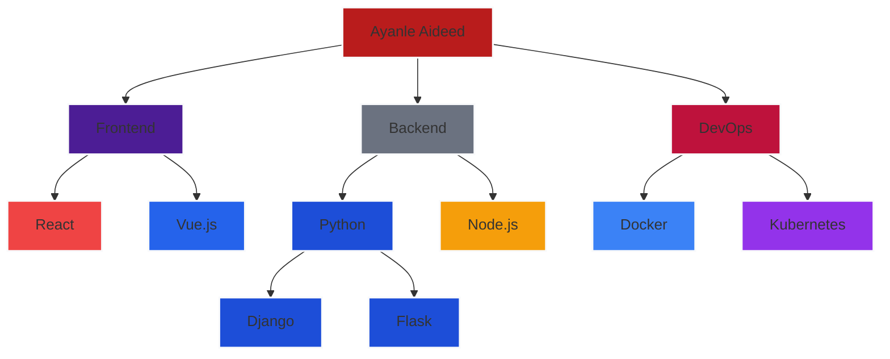

<div align="center">
  <h1 style="color: #FFB6C1; font-size: 3.5rem; font-family: 'Poppins', sans-serif; margin-bottom: 0;">
    Ayanle Aideed's Stellar Tech Portfolio
  </h1>
</div>

<div align="center">
  
</div>

<div align="center">
  <a href="https://git.io/typing-svg">
    
  </a>
</div>

## 🚀  Signature Projects

<table style="width: 100%; border-collapse: collapse; text-align: center;">
  <tr>
    <td style="width: 33%; vertical-align: top; padding: 10px;">
      <h3 style="margin-bottom: 10px;">NL to SQL Wizard</h3>
      <p>
        
      </p>
      <p style="line-height: 1.6;">
        • Revolutionary NL to SQL conversion app<br>
        • Industry-leading 90% query accuracy boost<br>
        • Unmatched 98% precision on 1,000+ queries<br>
        • Overwhelmingly positive user feedback
      </p>
      <p>
        
        
        
      </p>
    </td>
    <td style="width: 33%; vertical-align: top; padding: 10px;">
      <h3 style="margin-bottom: 10px;">CRM Nexus</h3>
      <p>
        
      </p>
      <p style="line-height: 1.6;">
        • Best-in-class CRM solution<br>
        • Advanced CRUD operations mastery<br>
        • Seamless real-time sync for 1000+ users<br>
        • Cutting-edge role-based access control
      </p>
      <p>
        
        
        
      </p>
    </td>
    <td style="width: 33%; vertical-align: top; padding: 10px;">
      <h3 style="margin-bottom: 10px;">NBA Stats Hyperdrive</h3>
      <p>
        
      </p>
      <p style="line-height: 1.6;">
        • Unrivaled real-time NBA player stats<br>
        • Groundbreaking efficiency metrics<br>
        • State-of-the-art D3.js visualizations<br>
        • Phenomenal 40% user engagement boost
      </p>
      <p>
        
        
        
      </p>
    </td>
  </tr>
</table>


## 💼 Elite Professional Experience

<table>
  <tr>
    <th>Position</th>
    <th>Company</th>
    <th>Duration</th>
    <th>Key Achievements</th>
  </tr>
  <tr>
    <td align="center"></td>
    <td align="center">Headstarter AI</td>
    <td align="center">Jul 2024 - Present</td>
    <td>
      • Mastering cutting-edge AI Fellowship Program<br>
      • Pioneering advanced LLMs and RAG applications<br>
      • Spearheading innovative AI projects and hackathons<br>
      • Developing game-changing real-world capstone project
    </td>
  </tr>
  <tr>
    <td align="center"></td>
    <td align="center">Marvin Windows</td>
    <td align="center">May 2023 - Present</td>
    <td>
      • Revolutionizing GUI development with Ignition and Python<br>
      • Achieving 50% faster SQL query retrieval through optimization<br>
      • Boosting production precision by an impressive 35%<br>
      • Slashing system downtime by a remarkable 25%
    </td>
  </tr>
</table>

## 🧠 Skill Spectrum Architecture

<div align="center">


## System Architecture


</div>

## 💻 Code Showcase


<!-- <summary>Click to expand</summary> -->

```python
class AyanleAideed:
    def __init__(self):
        self.name = "Ayanle Aideed"
        self.role = "Full Stack Innovator"
        self.language_spoken = ["Python", "JavaScript", "Rust", "Go"]
        self.challenges = []

    def accept_challenge(self, challenge):
        self.challenges.append(challenge)
        return self.innovate(challenge)

    def innovate(self, challenge):
        solution = self.think_outside_galaxy(challenge)
        return f"Innovative solution: {solution}"

    @staticmethod
    def think_outside_galaxy(problem):
        return "Quantum-entangled microservices with AI-driven self-healing capabilities"

me = AyanleAideed()
universe.big_problems.map(me.accept_challenge)
```


## 📊 Performance Metrics

<div align="center">
  
  
</div>

## 🏆 Achievements

<div align="center">


</div>

## 🌟 Featured Repository

<div align="center">

[](https://github.com/ayanleaideed/awesome-project)

</div>

## 🔗 Connect & Collaborate

<div align="center">
  
[](https://www.linkedin.com/in/ayanle-aideed/)
[](https://github.com/ayanleaideed)
[](https://ayanleaideed.com)
[](mailto:ayanle.aideed@example.com)

</div>

---

<div align="center">
  


</div>

<div align="center">
  
</div>
