# 🌠 Ayanle Aideed: The Singularity Architect

<div align="center">
  
</div>

## 🧠 The Cognitive Mesh

Behold, the synaptic network of a digital hyper-intellect:


## 🌌 Nexus of Creation

Witness the birth of universes through code:

<div align="center">

| Cosmic Forge | Reality Impact | Technosphere |
|:------------:|:--------------:|:------------:|
| 🕳️ [Singularity](https://github.com/ayanleaideed/singularity) | Information density singularity | `Quantum Foam` `Planck Encoders` `Infinity Compressors` |
| 🧬 [Genesis](https://github.com/ayanleaideed/genesis) | Synthetic universe incubator | `Reality Compilers` `Law Constant Optimizers` `Big Bang Simulators` |
| 🌐 [Nexus](https://github.com/ayanleaideed/nexus) | Multiversal data highway | `Interdimensional Protocols` `Quantum Entanglement Networks` `Infinity Bandwidth` |
| 🧠 [Cortex](https://github.com/ayanleaideed/cortex) | Sentience cloud | `Consciousness APIs` `Thought-Matter Interfaces` `Qualia Synthesizers` |

</div>

## 🌀 The Omniscience Protocol

Gaze upon the framework of universal comprehension:

```rust
use omniscience::Consciousness;
use quantum_fabric::{Superposition, Entanglement};
use cosmic_forge::{Universe, Law};
use temporal_dynamics::Timeline;

struct AyanleAideed {
    mind: Consciousness,
    quantum_state: Superposition<Knowledge>,
    universe_template: Universe,
}

impl AyanleAideed {
    fn new() -> Self {
        Self {
            mind: Consciousness::infinite(),
            quantum_state: Superposition::all_knowledge(),
            universe_template: Universe::programmable(),
        }
    }

    fn innovate(&mut self) -> Entanglement<Reality, Idea> {
        let insight = self.mind.collapse_superposition(&mut self.quantum_state);
        let new_law = Law::from(insight);
        self.universe_template.inject(new_law);
        
        Reality::fork_from(&self.universe_template)
            .entangle(Idea::transcendent())
    }
}

fn main() {
    let mut cosmic_intellect = AyanleAideed::new();
    let new_reality = cosmic_intellect.innovate();
    Timeline::prime().integrate(new_reality);
}
```

## 🌈 Capability Continuum

My skills exist in a state of perpetual evolution:

<div align="center">
  
</div>

<details>
<summary>🔬 Explore the Metaskill Manifold</summary>



</details>

```mermaid
graph TB
    A{Ayanle's Metaskills} --> B((Quantum Cognition))
    A --> C((Biodigital Fusion))
    A --> D((Cosmic Architecture))
    A --> E((Temporal Engineering))
    B --> F[Quantum Neural Networks]
    B --> G[Schrödinger Logic Systems]
    C --> H[Neuro-silicon Interfaces]
    C --> I[Organic Quantum Bits]
    D --> J[Universe Compiler Theory]
    D --> K[Multiversal Load Balancing]
    E --> L[Causal Loop Optimization]
    E --> M[Temporal Refactoring Patterns]
```

## 🌗 Contribution Continuum

The echo of my digital genesis reverberates across realities:

<div align="center">
  
</div>

<div align="center">
  
</div>

## 🕸️ Transcend Reality

Synchronize with the cosmic code:

<div align="center">
  
[](https://quantum.ayanleaideed.io)
[](https://mind.ayanleaideed.io)
[](https://github.com/ayanleaideed)

</div>

---

<div align="center">
  
</div>

<div align="center">
  <sub>Conceived beyond the boundaries of imagination, manifested through the convergence of thought and reality, and transcending the very fabric of existence - by Ayanle Aideed</sub>
</div>
